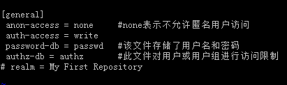
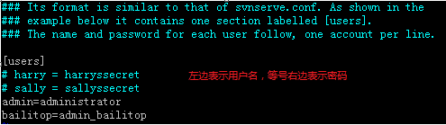
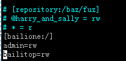

# Title: SVN多项目服务搭建及配置

## 一、安装SVN
**略**
## 二、配置SVN
### 1、创建仓库
创建仓库就是创建工作项目，如图1所示：

** 图1 **

### 2、配置svnserve.conf
SVN的配置文件比较简单，配置起来也比较容易，当创建多个工作项目，而又想共用所有的用户，此时，可以更改配置文件中的password-db属性，让它们共享同一个用户和密码。图2为默认配置，如下图所示：

**图2**

### 3、创建用户
创建SVN用户，只需要修改passwd文件即可，将所有用户建在“[users]”下，格式为“username=password”，注释格式为“# 注释文字”，如图,如图3所示:

**图3**

创建SVN分组，以及分配SVN权限需要修改authz配置文件。
1.创建组，格式为：
>[groups]  
组名1=用户名1  
组名2=用户名2，用户名3，用户名4  

（注意：这里的用户名必须是“passwd”文件中已定义的用户名）  
2.分配权限，用例如图4下：

**图4**

其中,bailione表示项目版本库，  
/表示bailione项目版本库的根目录。  
@har,ry_and_sally=rw表示harry_and_sally这个组具有可读可写的权限。  
bailitop=rw表示用户bailitop具有可读可写的权限。  

## 三、启动SVN服务
启动SVN服务器比较简单，如果想让它在后台运行，只需要加上d选项，而r选项是告诉SVN,它的根目录在哪儿。 

**图5**

## 四、客户端连接
客户端连接时输入地址“svn://[服务器IP地址]/bailione”，之后，输入用户名和密码即可。
