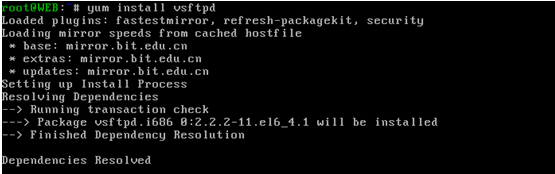
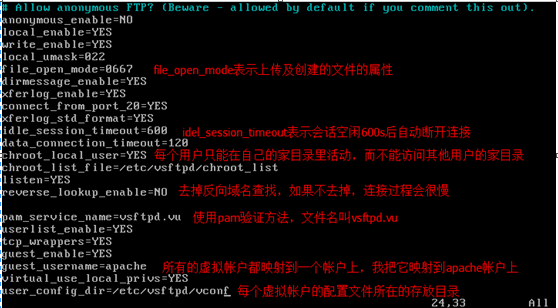
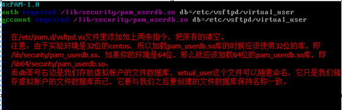
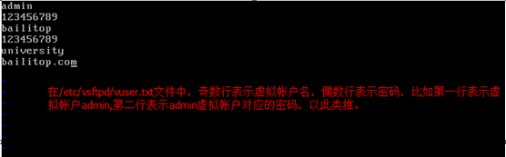
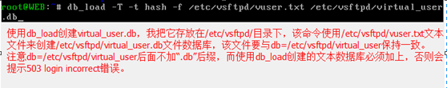
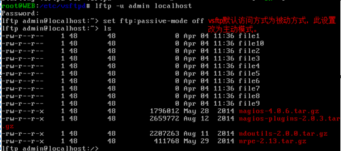

# Title: vsftpd的搭建与配置

## 概述

&emsp;&emsp;vsftpd是目前使用最广泛的FTP服务器软件之一，由于它的安全性而被广泛使用，许多linux发行版默认安装的FTP软件就是vsftpd，本文档主要讲述vsftpd服务器的搭建及配置，重点介绍vsftpd虚拟帐户的配置。通过虚拟帐户可以对单独某个帐户进行权限及属性设置。  
## 搭建及配置过程
&emsp;&emsp;vsftpd的搭建过程相当容易，可以通过源代码自己编译，也可以通过在线安装，本文使用在线安装的方法安装FTP服务器软件。
首先安装vsftpd，如图1：
  

** 图1 **
  
&emsp;&emsp;对/etc/vsftpd/vsftpd.conf进行配置，使其开启虚拟帐户模式，下面对部分重要的指令进行了解释，如图2：  

** 图2 **
  
&emsp;&emsp;我们使用pam验证方式，复制一份/etc/pam.d/vsftpd命名为/etc/pam.d/vsftpd.vu，之后我们使用这个配置文件，如图3：  

**  图3 **
  
&emsp;&emsp;打开这个文件（/etc/pam.d/vsftpd.vu）在里面添加图片上所示的内容，如图4所示：  

** 图4 **
  
&emsp;&emsp;配置完/etc/pam.d/vsftpd.vu后，接下来就是创建虚拟帐户配置文件所在的目录vconf，如图5所示：  

** 图5 **
  
&emsp;&emsp;创建vconf之后，再创建一个文件我命名为/etc/vsftpd/vuser.txt，用它来创建文本数据库文件virtual_user.db，如图6：  

** 图6 **
  
&emsp;&emsp;打开之前创建的文件/etc/vsftpd/vuser.txt，在里面添加想要创建的用户名及密码，如图7所示：  

** 图7 **
  
&emsp;&emsp;完成上面的步骤之后，使用db_load来创建文本数据库，如图8所示：  

** 图8 **
  
&emsp;&emsp;接下来要做的就是创建配置文件，虚拟用户的配置文件名称必须与虚拟帐户保持一致，文件里的内容可以是vsftpd.conf的内容，也可以是里面的其中几个，主要是用以个性化虚拟用户，如图9：  

** 图9 **
  
&emsp;&emsp;图10是其中一个配置文件的内容：  

** 图10 **
  

## 测试

&emsp;&emsp;完成以上所有的操作之后，我们的虚拟帐户配置就完成了，接下来就是要进行测试一下我们配置的虚拟帐户访问方式是否可行，这里我们使用lftp命令去测试，如图11：  

** 图11 **
  

