# Title: 豆瓣网技术架构的发展历程


Author: 洪强宁(豆辩网技术架构师)
## 豆辩网简介

+ 2005年3月上线
+ 以分享和发现为核心的社区
+ 读书、电影、音乐、小组、同城、九点
+ 我的豆辩、友邻


## 一些数据

+ 2.8M注册用户，约1/4活跃用户
+ 千万级非注册用户
+ 20M动态请求/天，峰值500~600/sec
+ 23台普通PC服务器(1U*15/2U*8)
+ 12台提供线上服务
+ 38G memcached

## 单服务器

+ 单台1U服务器 (frodo)
 + 单核AMD Athlon 64 1.8GHz
 + 1G内存，160G SATA*2
+ Gentoo Linux
+ MySQL 5
+ Quixote (a Python web framework)
+ Lighttpd + SCGI (shire)
+ Memcached (!)

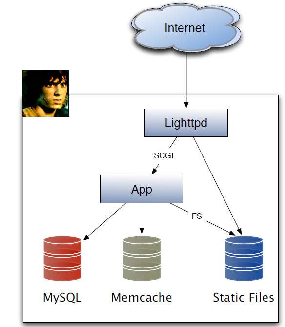

## Gentoo Linux

+ 容易维护
 + emerge mysql
 + ebuild 便于管理 patch
+ 只安装需要的东西
+ 安全性
 + GLSA(Gentoo Linux Security Advisories)

## MySQL

+ The world’s most popular open source database
+ 写少读多/写多读少 ==> MyISAM
+ 读写并发高 ==> InnoDB
+ Replicate for backup

## Python

+ 开发迅速
+ Battery Included
+ 第三方库成熟
+ 社区成长中
 + CPUG: http://python.cn/

## Quixote

+ 简单，轻量，易于实现REST风格的URL
+ 当时还没有Django, TurboGears, Pylons这些选择，只有一个笨重的ZOPE
+ http://www.douban.com/subject/1000001
```python
# luz/subject/__init__.py
def _q_lookup(request, name):
      subject = get_subject(name)
      return lambda req: subject_ui(req, subject)
# luz/subject/subject_ui.ptl
def subject_ui [html] (request, subject):
      site_header(request)
      “<h1>%s</h1>” % subject.title
      site_footer(request)
```

## Lighttpd

+ 很好的动态和静态性能
+ 原生SCGI支持
 + SCGI: 一个简化版本的FastCGI，由Quixote开发者开发
+ 所有的请求都通过80端口的lighttpd进程分发，动态内容走SCGI到localhost上的Quixote进程。

## Memcache

+ 从上线起就在使用，有效减轻MySQL负担
+ 对libmemcache做了python封装（使用Pyrex），性能是纯python版的3x+
```python
def get_subject(subject_id):
      subject = mc.get(‘s:’+subject_id)
      if subject is None:
           store.farm.execute("select xxx, xxx from subject where id=%s",subject_id)
           subject = Subject( *store.farm.fetchone())
           mc.set( 's:' +subject_id,subject)
      return subject
```

## 问题出现

+ 1.2M动态请求/天
+ 磁盘IO成为瓶颈
+ 需要寻找新机房

## 解决方案

+ 购买两台1U服务器
 + pippin 和 meriadoc (后改名merry)
 + 双核, 4G内存，250G SATA*3
+ 一台作为应用服务器，一台作为数据库服务器
+ 迁移到双线双IP机房，使用DNS解析不同网段IP -_-b
+ 开始多人协作开发，frodo做为开发用机(subversion, trac, etc...)

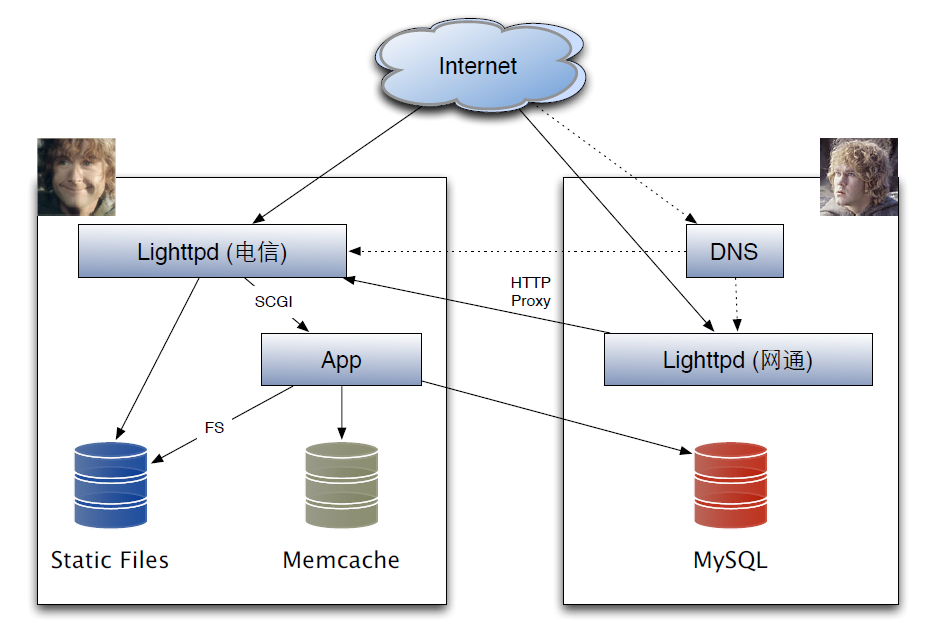

## 几点发现

+ 数据库的内存分配对性能影响重大
 + innodb_buffer_pool_size
+ 磁盘随机寻道速度比吞吐量更重要
+ 网上找来的IP段分布很不靠谱

## 问题又出现

+ 1.5M动态请求/天，尚未到性能瓶颈
+ 机房不靠谱，频繁故障
+ IP段分布数据不靠谱，用户反映访问缓慢

## 解决方案

+ 换到靠谱的机房，多线单IP(BGP)
+ 购买了一台新服务器 (arwen)
 + 74G 1w转 SATA * 3
 + 做为数据库服务器
+ 开始使用专门的服务器作后台计算

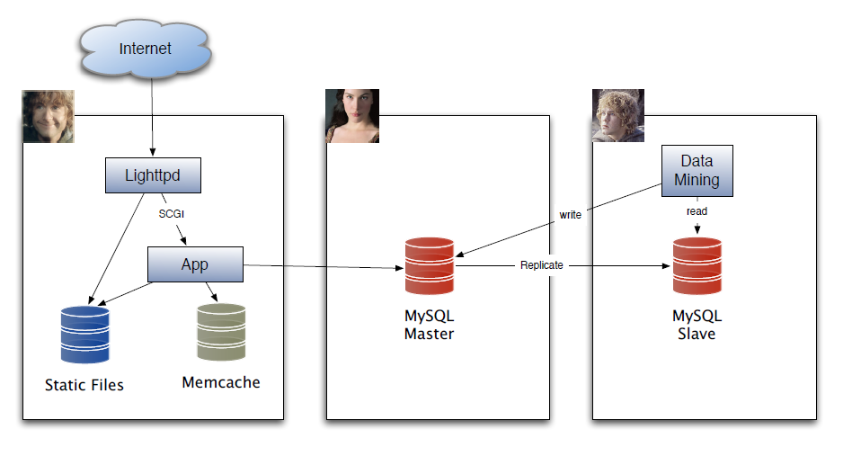

## 问题出现

+ 2M动态请求/天
+  静态文件服务磁盘IO成为瓶颈
 + 上百万的小图片（用户头像、封面图片, etc...）
+ 数据库服务器接近瓶颈

## 解决方案

+ 购买三台服务器，双核，4G，250G SATA*3
+ 将图片从一个大目录切分成10000个文件一个目录
 + mod_rewrite保持URL不变
+ 独立的图片lighttpd进程，启用mod_memcache模块，缓存小图片
 + 减小磁盘IO对页面访问的影响
+ 将应用服务从web服务器独立出去
 + 把更多的内存分配给静态文件服务
+ 增加一个只读数据库

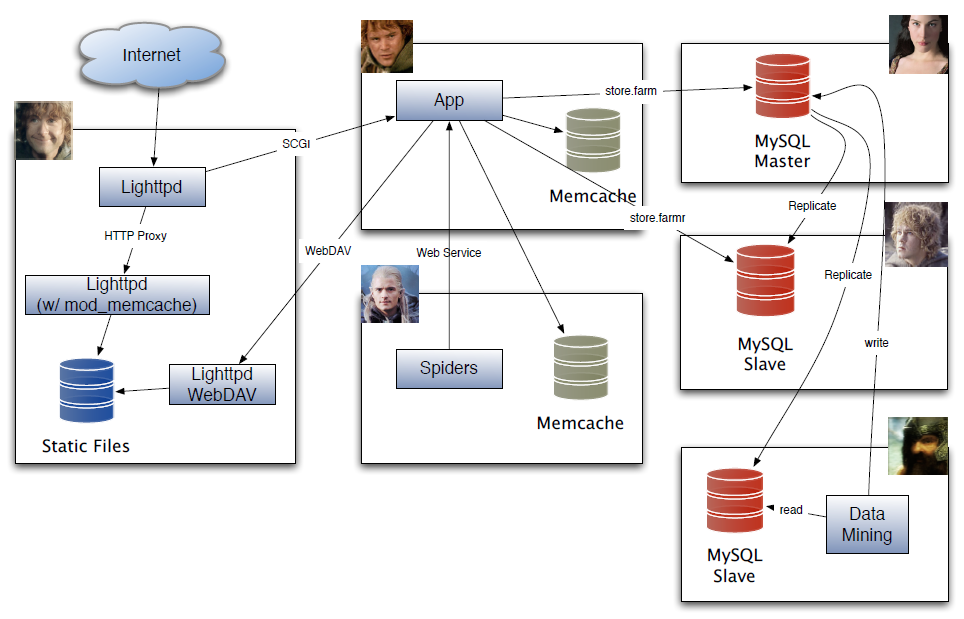

## 只读数据库

+ store增加farmr属性，为一个可用的只读数据库游标
+ 头疼的replicate delay问题
 + 辅库复制需要时间
 + 更新主库后，下一个请求往往就是要读数据（更新数据后刷新页面）
 + 从辅库读会导致cache里存放的是旧数据
   + 灵异事件！
+ 解决方法：更新数据库后，在预期可能会马上用到的情况下，主动刷新缓存
 + ......不完美，but it works

## 避免replicate delay引起的灵异事件
```python 
def get_subject(sid):
      sbj = mc.get(‘s:’+sid)
      if sbj is None:
            sbj = flush_subject(sid, store.farmr)
            return sbj
def flush_subject(sid, cursor=None):
      cursor = cursor or store.farm
      cursor.execute(“select ... from subject”)
      subject = Subject(*cursor.fetchone())
      mc.set(‘s:’+sid, subject)
      return subject
def update_subject(subject, props):
     store.farm.execute(“update subject ...”)
     store.farm.connection.commit()
     flush_subject(subject.id, store.farm)
```

## 问题出现

+ 2.5M动态请求/天
+ 数据库磁盘空间不够了
 + 我上/九点数据量庞大
+ SATA盘故障率高
+ 数据库压力增大

## 解决方案

+ Scale Up，购买四台1U服务器
 + 16G内存，147G SCSI *2 + 500G SATA
 + SCSI 做 RAID-0
+ 用MySQL Slave来保证冗余
+ 增加memcached节点数目
+ 所有的MyISAM表都改为InnoDB表
 + 提高内存利用效率
+ 将全文搜索移至Sphinx

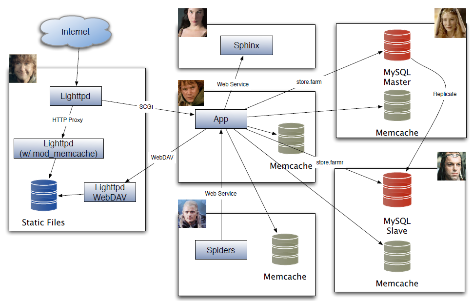

## 问题出现

+ 5.2M动态请求/天
+ 图片流量费用成为最大成本
+ Web服务器的磁盘IO还是会影响动态页面性能
+ 应用服务器进程数不够了
+ 机柜空间不够了

## 解决方案

+ 天津的机房便宜一些 :)
 + 承担图片流量
 + 后台数据挖掘计算
 + 容灾备份
+ 购买3台1U服务器：4核，32G内存，1T SATA * 3
+ 优化前端，启用 otho.douban.com 和 lotho.douban.com 域名
 + lighttpd 1.5 with aio support
 + 部署LVS
+ Scale Up: 应用服务器内存升级 4G -> 8G

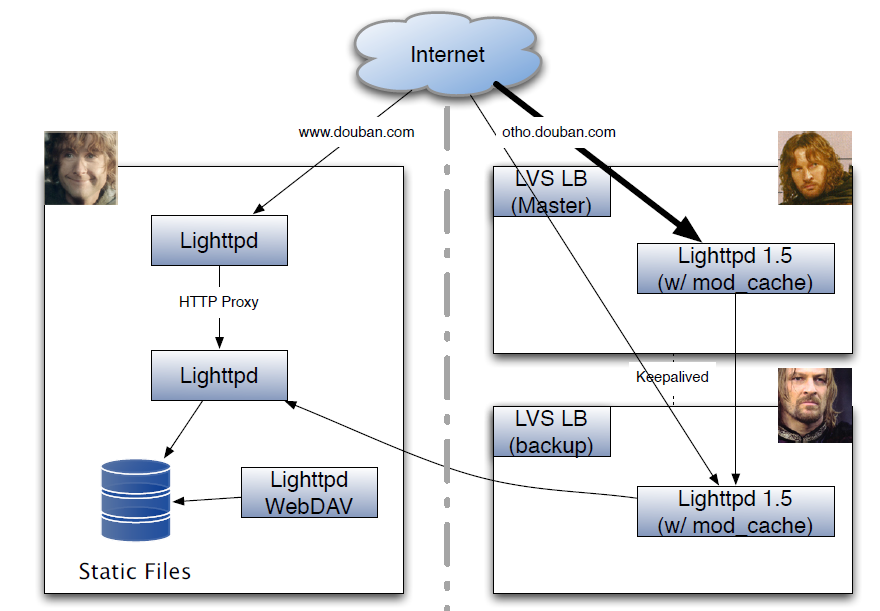
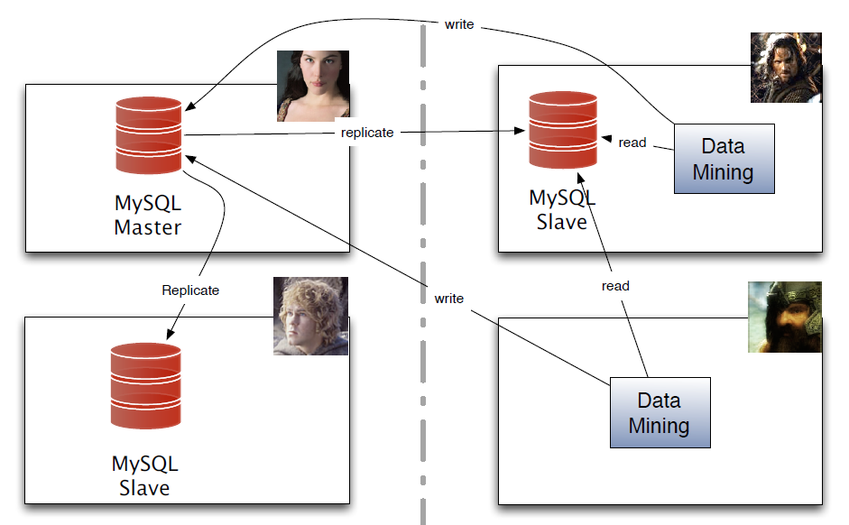

## 问题出现

+ 6.4M动态请求/天 (5M PV)
+ 应用服务器成为瓶颈
 + 内存：占用总是增长，似乎有内存泄露
 + CPU：memcache对象序列化/反序列化

## 解决方案

+ 第二台应用服务器上线
 + lighttpd的mod_scgi只能round-robin
 + lighttpd 1.5不稳定
 + mod_proxy
   + proxy.balance = fair (load based, passive balancing)  
+ 当进程占用内存超过阈值，当前请求完成后自杀
+ 使用spread聚合日志

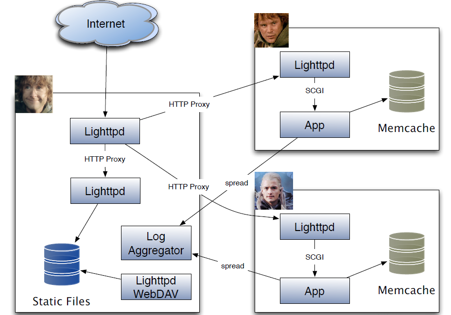

## 问题出现

+ 11M动态请求/天（3台应用服务器）
+ 跨机房写入成为后台计算的瓶颈
+ Sphinx的定制性不够
+ 相册产品开发中，需要解决图片存储问题
+ 灵异现象： 网站变慢，积攒了大量连接得不到处理，load却不高

## 解决方案

+ 数据库分库
 + 九点相关表独立出来
 + 数据挖掘相关表独立出来，主库放在天津，北京只读
+ Sphinx -> Xapian
+ 使用MogileFS
+ libmemcache -> libmemcached，使用consistent hash降低memcache调整代价
 + 修正libmemcached的consistent hash相关bug
+ 应用服务器升级至四核CPU
 + 修正libmemcached的failover相关bug
+ 用nginx替代lighttpd做load balance
+ 最后发现罪魁祸首是spread，��
 + 改成用nginx记录日志

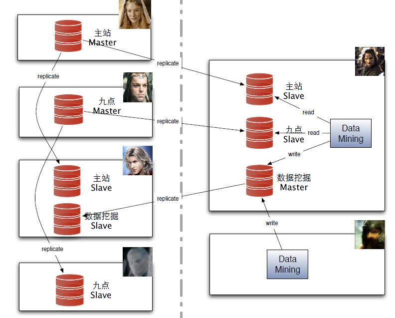

## 多数据库连接

+ 表名全局唯一，维护一个表名至数据库的映射
+ store.farm[r] -> store.get_cursor(table=‘xxx’,ro=True/False)
```python 
def flush_subject(sid, ro=False):
      cursor = store.get_cursor(table=‘subject’, ro=ro)
      cursor.execute(“select ... from subject”)
      subject = Subject( *cursor.fetchone())
      mc.set(‘s:’+sid, subject)
      return subject
```
+ 在数据库间挪表变得容易，在主辅库间平衡负载也变得容易

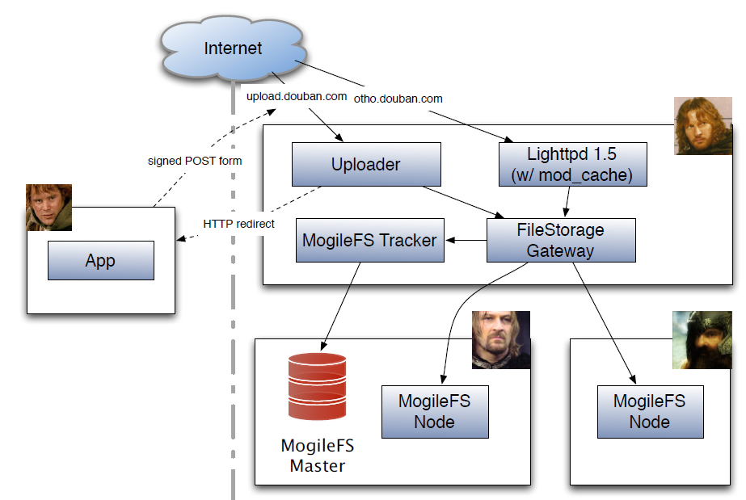
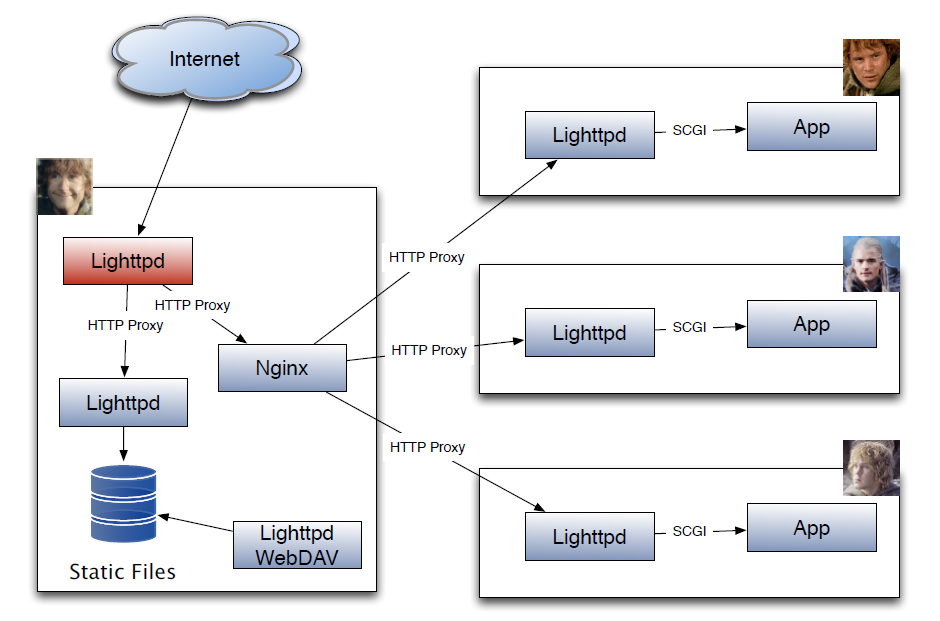

## 问题出现

+ 13M动态请求/天
+ 计划将所有静态图片都导入MogileFS
 + 文件小，数量大，Tracker DB可能成为瓶颈
+ 相册产品很受欢迎，存储空间开始紧张

## 解决方案

+ 购买8台新服务器
 + 32G内存，四核CPU
 + (300G SCSI×2 + 1T SATA) × 3
 + (1T SATA × 3) × 5
 + 6台北京，2台天津
+ 开发DoubanFS

## DoubanFS

+ 没有中心数据库，直接按照文件名hash查找所在节点，可伸缩性更好
+ 按照hash值存成目录树，每个节点负责一组hash值区域
+ 定时同步，基于文件修改时间的Merkle Tree
+ 利用consistent hash减少增删节点带来的数据移动量
+ WebDAV作为读写接口
+ 读性能为MogileFS的3倍，写性能为50倍

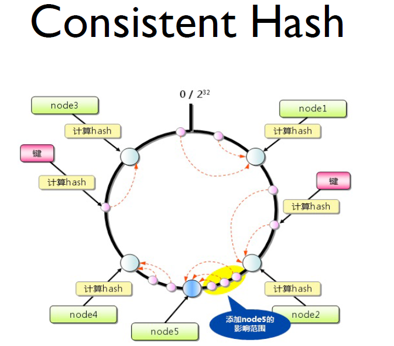
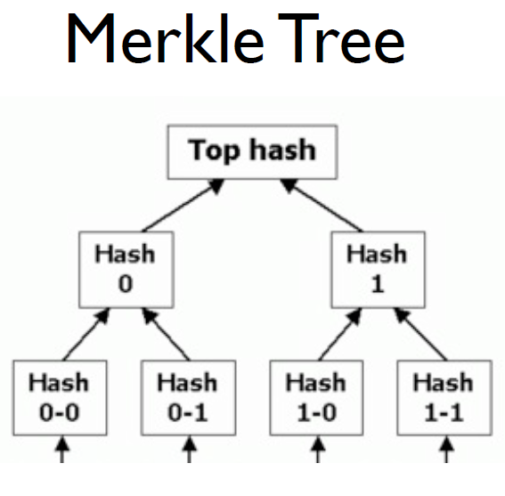
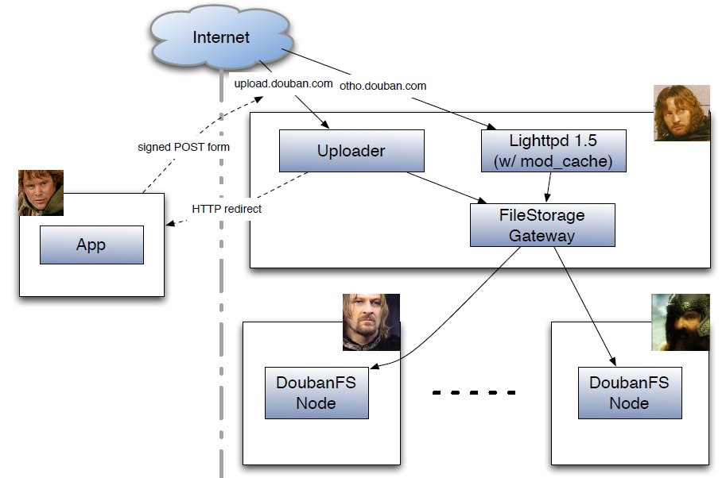

## 问题出现

+ 16M动态请求/天
+ 数据库大文本字段严重影响了数据库性能
+ DoubanFS中小图片导致IO增高
+ 数据库可用性要求提高

## 解决方案

+ 开发DoubanDB
 + 更好的伸缩性
 + 大文本字段移出后，MySQL的性能得到增强
+ MySQL双Master方案
 + failover更简单
 + 解决replicate delay问题

## DoubanDB

+ 分布式Key-Value数据库
+ 从Amazon Dynamo获得灵感，做了一些简化
+ 三个接口：set(key, value), get(key), delete(key)
+ memcache协议作为读写接口
+ 真正的Merkle Tree，基于内存，后改为基于磁盘文件
+ Consistent Hash
+ 用TokyoCabinet做为底层存储
+ 数据库中的大文本字段进入DoubanDB
+ DoubanFS 2.0 基于 DoubanDB 实现

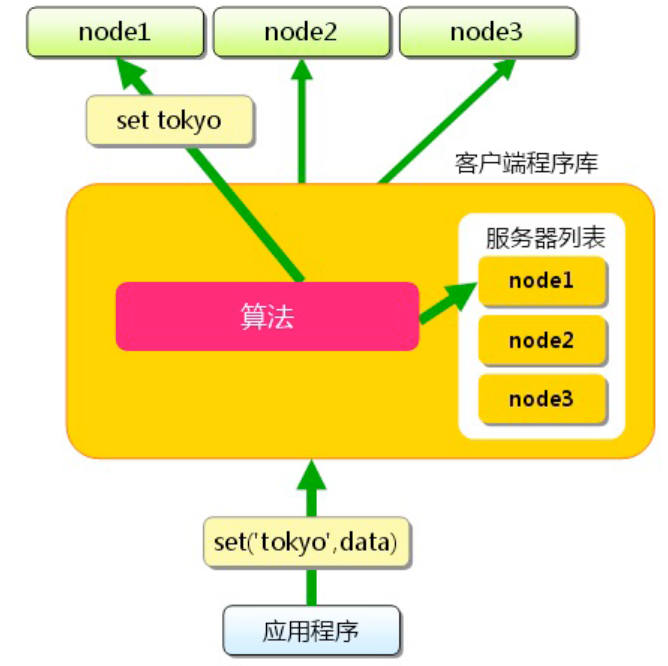
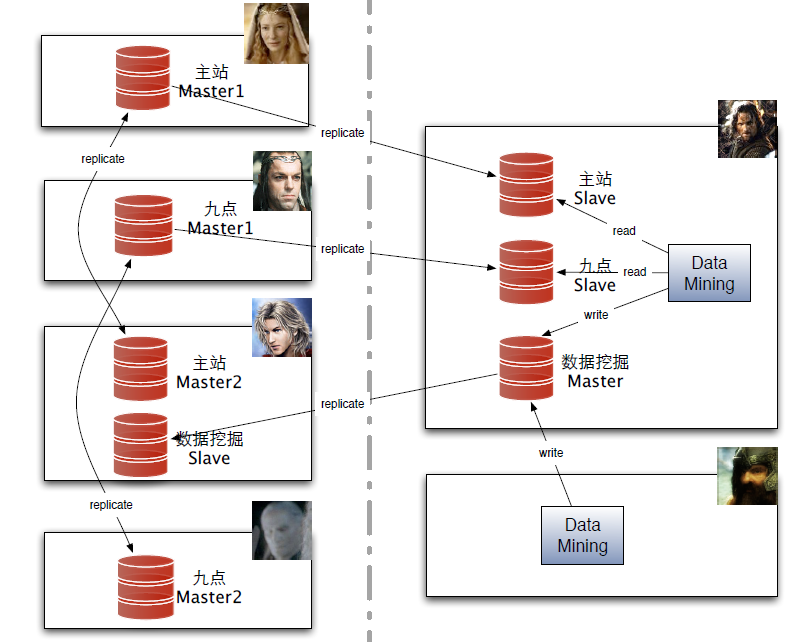

## 最新的一些改动

+ 将DoubanFS和数据挖掘程序移回北京机房
 + 简化文件上传流程和代码
 + 更好的利用硬件资源
+ 使用ngnix作为最前端
+ www.douban.com也部署LVS
+ 使用RabbitMQ代替spread

## 一些经验

+ 把钱花在内存上是值得的
+ 建立良好的profile工具，并利用之
+ memcache并不廉价，仔细控制cache的对象大小和访问方式
+ 避免数据库的join操作
+ 在产品上做出限制以避免过慢的查询
+ 仔细拆分前后台运算


