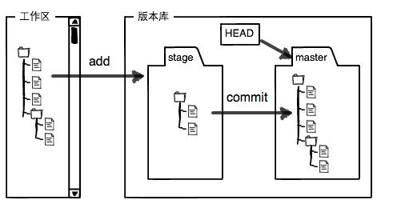

# Title: git使用入门


## 简介
git是目前世界上最先进的分布式版本控制系统（没有之一）。  
这篇文档主要介绍了git经常使用的操作命令，方便日后的命令查询，如果对GIT一点儿都不懂，建议学习廖雪峰的[git教程](http://www.liaoxuefeng.com/wiki/0013739516305929606dd18361248578c67b8067c8c017b000)。此教程通俗易懂，非常适合初学者。
## 特点
+ 高端大气上档次
+ 操作简单
+ 高效率

## git工作流程



## 常用命令

+ 检出仓库： `git clone <仓库地址>`
+ 查看远程仓库：`git remote -v `
+ 添加远程仓库：` git remote add [名字] <远程仓库地址>`
+ 删除远程仓库：`git remote rm <远程仓库地址>`
+ 修改远程仓库：`git remote set-url --push [名字] <远程仓库地址>`
+ 拉取远程仓库：`git pull [远程地址]  [远程分支]:[本地分支]`
+ 推送远程仓库：`git push [远程地址]  [本地分支]:[远程分支]`
+ 提交到暂存区：`git add <文件名>`
+ 提交到分支：`git commit -m "your message"`

## 分支相关操作命令

+ 查看本地分支：`git branch`
+ 查看远程分支：`git branch -r`
+ 创建本地分支：`git branch <名字>`
+ 切换分支：`git checkout <名字>`
+ 创建新分支并立即切换到新分支上去：`git checkout -b <名字>`
+ 删除本地分支：`git branch -d <名字>`
+ 强制删除本地分支：`git branch -D <名字>`
+ 删除远程分支：`git push [远程地址] :heads/[name] 或 git push [远程地址] :<name>`
+ 合并分支：`git merge <名字>`
+ 创建远程分支（本地分支push到远程）：`git push origin <name>`

## 版本(tag)操作相关命令

+ 查看版本：`git tag`
+ 创建版本：`git tag <name>`
+ 删除版本：`git tag -d <name>`
+ 查看远程版本：`git tag -r`
+ 创建远程版本（本地版本push到远程）：git push origin <name>`
+ 删除远程版本：git push origin :refs/tags/[name]`
+ 合并远程仓库的tag到本地：`git pull origin --tags`
+ 上传本地tag到远程仓库：`git push origin --tags`
+ 创建带注释的tag：`git tag <name> -m "your message"`

## 本地合并代码上线流程

```
git checkout develop 
git status 
git pull origin develop 
git checkout master 
git pull origin master 
git merge �Cno-ff develop -m "合并版本" 	##合并版本：将 develop 分支内容合并到 master 分支上
git push origin master 					##推送 master 分支内容到远程 master 分支
```

`--no-ff`：不使用fast-forward方式合并，保留分支的commit历史
`--squash`：使用squash方式合并，把多次分支commit历史压缩为一次


## 撤回修改等

+ 查看一下分支合并日志：git log --graph --pretty=oneline --abbrev-commit 

+ 回到过去版本：	git reset --hard master@{1}

+ 修改了，没有git add，已提交过 想撤销这次修改，git checkout a.txt or /src/

+ 修改了，已git add，git reset a.txt

+ 撤销到某一个版本，但是当前暂存区、工作区不想撤销，git reset --soft commitId

+ 如果修改了某几个文件到暂存区，想撤销到某个commit，git reset --hard commitId

## 忽略一些文件、文件夹不提交
在仓库根目录下创建一个名为“.gitignore”的文件，往里面写入不需要的文件夹名或文件，每个元素占一行即可，如下所示：
```shell
target
cache
*.jpg
```

## 分支管理

+ 主分支 master
+ 开发分支 develop 
+ 功能分支 feature 
+ 预发布分支  release
+ bug 分支 fixbug
+ 其它分支 other
