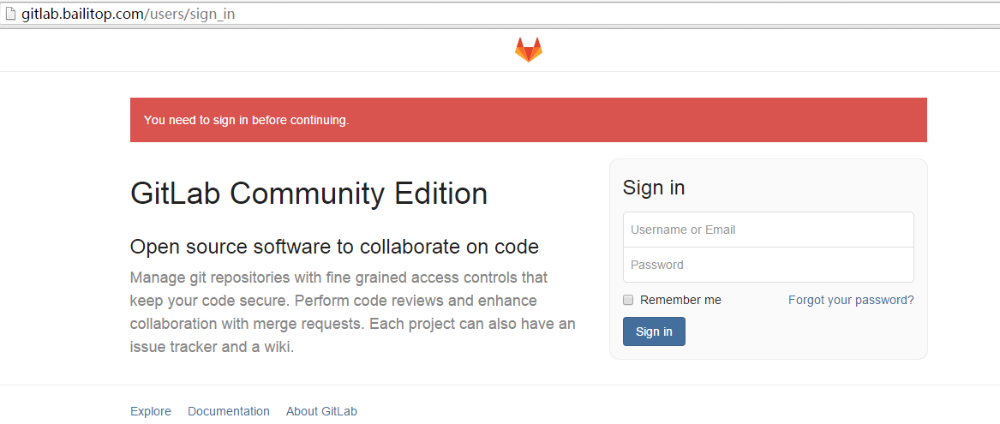

# Title: gitlab代码托管平台的搭建


## 简介

 GitLab是利用 Ruby on Rails 一个开源的版本管理系统，使用Git作为代码管理工具，并在此基础上搭建起来的web服务。它拥有与Github类似的功能，能够浏览源代码，管理缺陷和注释。可以管理团队对仓库的访问，它非常易于浏览提交过的版本并提供一个文件历史库。推荐使用ubuntu或debian。

GitLab requires the following software:

    Ubuntu/Debian/CentOS/RHEL
    Ruby (MRI) 2.0 or 2.1
    Git 1.7.10+
    Redis 2.0+
    MySQL or PostgreSQL

## 环境

+ OS ： debian 8.1 amd64
+ gitlab : 7-12-stable
+ gitlab shell : 2.6.3
+ ruby : 2.1.5
+ git : 2.1.4
+ redis : 2.8.17
+ mysql : 5.5.44
+ nginx : 1.6.2

## 系统用户
本次搭建所使用的帐户为bailitop，安装路径设为/home/bailitop/git/

## 数据库

本次搭建使用mysql数据库，官方推荐使用postgresql。此次搭建所需的数据库实例是事先建立好的，实例名`gitlab_production`
## redis

把redis server安装完后，启动redis即可，默认是监听127.0.0.1:6379，可以在配置文件中更改。

## GitLab

**下载源码** 

```shell
$ cd  /home/bailitop/git/ 
$ wget https://github.com/gitlabhq/gitlabhq/archive/7-12-stable.zip  
$ unzip 7-12-stable.zip 
$ mv gitlab-7-12-stable gitlab 
```

**安装依赖包** 

```shell
# aptitude install libicu-dev cmake pkg-config libmysqld-dev ruby-execjs rake
```

### 配置 

```shell
$ cd /home/bailitop/git/gitlab
$ cp config/gitlab.yml.example config/gitlab.yml
$ vim config/gitlab.yml #具体配置看里面的说明，注意它使用的是yaml格式
$ cp config/unicorn.rb.example config/unicorn.rb
$ vim config/unicorn.rb #里面可以设置它使用多少CPU核心数
$ cp config/initializers/rack_attack.rb.example config/initializers/rack_attack.rb
$ cp config/resque.yml.exaple config/resque.yml
$ vim config/resque.yml #设置连接redis server的信息
```

** 配置gitlab DB ** 

```shell
$ cd /home/bailitop/git/gitlab
$ cp config/database.yml.mysql config/database.yml #本次搭建使用mysql数据库
$ vim config/database.yml #配置连接信息
```
** Install Gems ** 

安装过程中使用source在国外，由于某种原因（你懂的）无法访问source。为此淘宝特意搭建了一个国内的source(https://ruby.taobao.org/)，每15分钟与国外的source同步一次，以确保国内的source与国外的source保持一致。

```shell
$ cd /home/bailitop/git/gitlab
$ vim Gemfile #将source的源更改为https://ruby.taobao.org/
$ bundle install --deployment --without development test postgres aws kerberos
```

以上的安装过程中可能会由于某些原因（权限）无法安装成功。因此，某些软件可能需要你使用超级用户去安装，如果出现刚才描述的情况，可以参考下面的操作（缺什么安什么）：
 
```shell
$ su -
# gem sources --remove https://rubygems.org/
# gem sources -a https://ruby.taobao.org/
# gem install charlock_holmes -v '0.6.9.4'
# gem install rugged -v '0.22.2'
# gem install mysql2 -v '0.3.16'
```

## gitlab shell

GitLab Shell是专为gitlab的SSH接入与仓库管理而开发的一个软件，本次搭建使用的版本号为v2.6.3，具体命令如下： 

```shell
$ cd /home/bailitop/git
$ wget https://github.com/gitlabhq/gitlab-shell/archive/v2.6.3.zip
$ unzip v2.6.3.zip
$ mv gitlab-shell-2.6.3 gitlab-shell
$ cd gitlab-shell
$ cp config.yml.example config.yml
$ vim config.yml #设置一些与gitlab相关的配置项
$ ./bin/install
```
## 初始化数据库并激活高级特性
```shell
$ cd /home/bailitop/git/gitlab
$ bundle exec rake gitlab:setup RAILS_ENV=production
```
如果以上操作不出现错误，它会输出默认的管理员用户`root`，及其密码`5iveL!fe`

## 安装初始化脚本
```shell
$ su -
# cd /home/bailitop/git/gitlab
# cp lib/support/init.d/gitlab  /etc/init.d/gitlab
```
由于不是按照官网默认设置，比如用户名，用户用录，所以启动脚本是需要修改的。由于/etc/init.d/gitlab在升级后会覆盖掉，因此官方建议使用另一种配置文件/etc/default/gitlab去修改这些配置项,操作如下： 

```shell
$ su -
# cd /home/bailitop/git/gitlab
# cp lib/support/init.d/gitlab.default.example /etc/default/gitlab
# vim /etc/default/gitlab #修改用户名，目录等
```
## Compile Assets

```shell
$ cd /home/bailitop/git/gitlab
$ bundle exec rake assets:precompile RAILS_ENV=production
```

## Check Application Status

```shell
$ cd /home/bailitop/git/gitlab
$ bundle exec rake gitlab:env:info RAILS_ENV=production
```

## nginx

gitlab官方网站推荐使用nginx作为gitlab的web server。


** 站点配置 ** 

```shell
$ su -
# cd /home/bailitop/git/gitlab
# cp lib/support/nginx/gitlab /etc/nginx/sites-available/gitlab
# ln -s /etc/nginx/sites-available/gitlab /etc/nginx/sites-enabled/gitlab
# vim /etc/nginx/sites-enabled/gitlab #进行相关配置，比如upstream，目录等等
```
以上配置完并检查无误后，启动nginx或者重新加载配置文件即可。

## 页面效果



