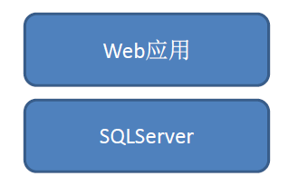
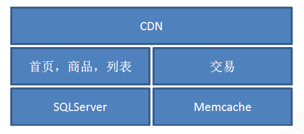
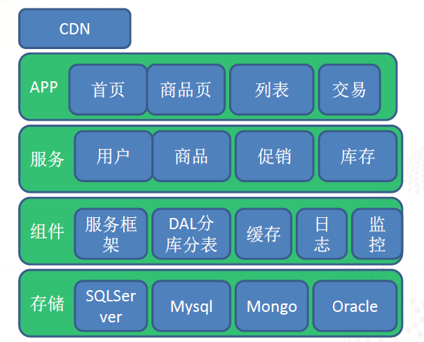
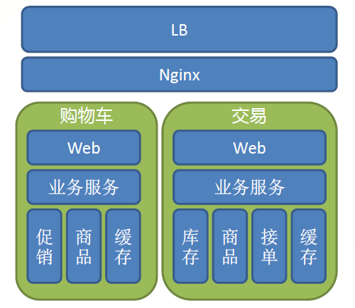

# Title: 京东系统架构演化

Author: 王晓钟（京东商城商级经理）

## v1 asp时代
简单的2层结构，无扩展能力

## v2 .net时代
+ 自建多个CDN节点
+ 两大系统：网站+交易
+ 部分应用使用Memcache扛读流量

### v2 .net时代-大促销-网站
**架构缺陷**  
+ 首页，频道，列表，商品页同在一个应用中部署在同一IIS进程中。任一模块消耗硬件资源即导致其他系统崩溃。
+ 系统内部耦合度过高，内部模块设计不合理

**架构改进**  
+ 系统拆分
+ 域名拆分
+ 静态化

### v2 .net时代-大促销-交易
**架构改进**  
+ 服务化：拆分促销，库存等逻辑。
+ 系统逻辑拆分：下单前逻辑和下单后逻辑迁移到不同的系统中。
+ DB复制，读写分离。

**经验教训**  
+ 服务化不够彻底，局部扩容难。
+ DB是瓶颈，以关系型数据为主，应用需要读取多个库。
+ 基础组件薄弱，日志，监控系统不完善

## v3 服务化时代

### v3 服务化时代-网站

### v3 服务化时代-交易

### v3 服务化时代-交易-大促销
**架构改进**  
+ .Net -> Java
+ 核心系统全面服务化：商品，促销，库存，用户等基础服务中心。
+ 基础组件：服务化框架，DAL层分库分表，缓存组件。
+ 数据结构Key-Value化。
+ 监控，日志系统

**高流量大并发下如何提供稳定服务？**  
+ 异步化，限流，分流，降级，压力测试，异地灾备

