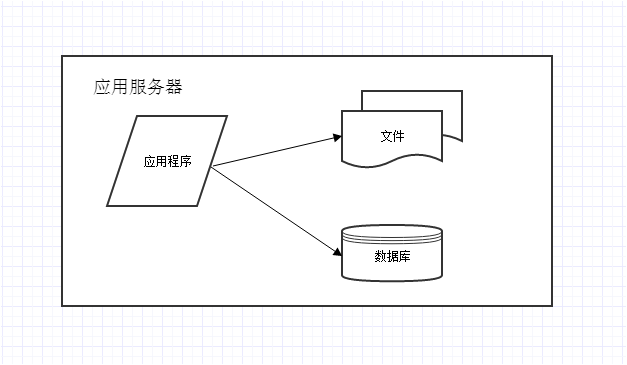
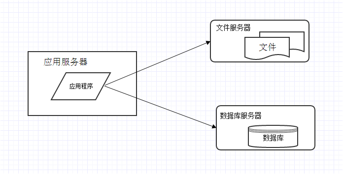
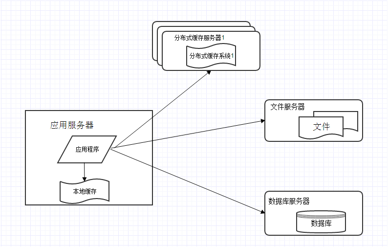
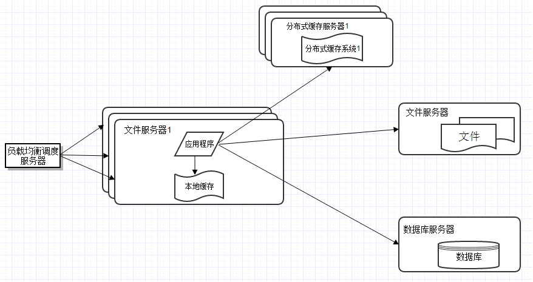
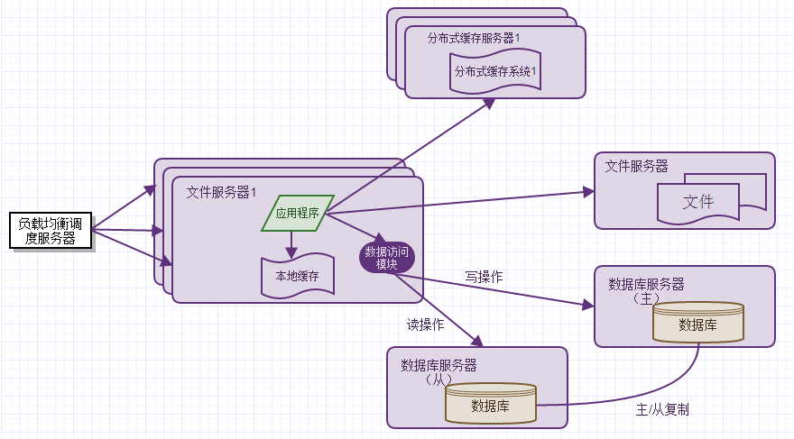
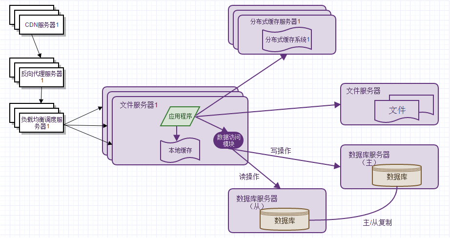
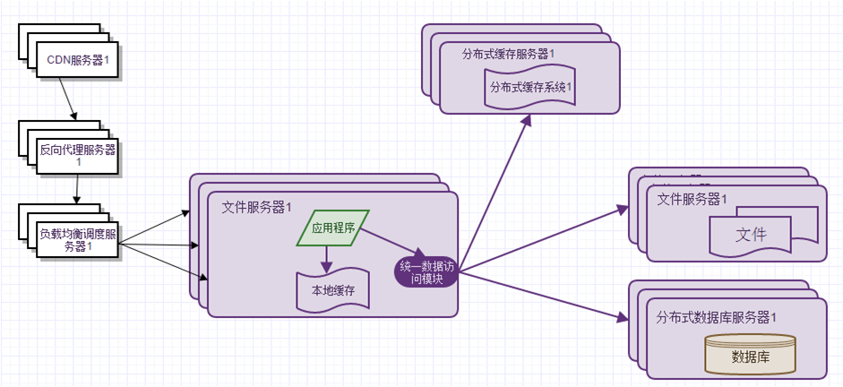
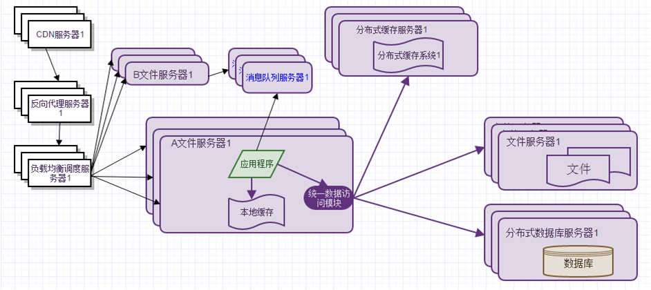

# Title: 大型网站技术架构的演化过程

## 特点
+ 高并发、大流量
+ 高可用
+ 海量数据
+ 用户分布广泛，网络情况复杂
+ 安全环境恶劣
+ 需求快速变更，发布频繁
+ 渐进式发展

## 演化历程

+ 初始阶段

+ 应用服务器和数据服务分离

+ 使用缓存改善网站性能

+ 使用应用服务器集群改善网站的并发处理能力

+ 数据库读写分离

+ 使用反向代理和CDN加速网站响应

+ 使用分布式文件系统和分布式数据库系统

+ 业务拆分

## 设计误区

+ 一味追随大公司的解决方案
+  为了技术而技术
+ 企图用技术解决所有问题

## 不要试图去设计一个大型网站

&emsp;&emsp;有些传统企业进军互联网，凭借其雄厚的资金、丰富的行业经验、近乎垄断的市场地位，试图在互联网领域开发一个大型网站复制其在传统行业的优势地位。但是互联网发展运行有其自己的规律，短暂的互联网历史已经证明这种企图是行不通的。  
互联网是一个开放和分享的世界，它是创新者的乐园，探险者的处女地，只要肯努力，富有想象力和聪明才智，能为用户创造价值，就有机会迅速聚集资金、人才和注意力，在很短的时间内发展壮大。

## 价值观

+ 大型网站架构技术的核心价值是随网站所需灵活应对
+ 驱动大型网站技术发展的主要力量是网站的业务发展

## 什么是最好的架构师

&emsp;&emsp;和团队相处日久，通常情况下团队成员感觉不出他的存在，貌似没有他工作也可以完成得很好，但是如果他真的离开了，大家就会觉得心里空荡荡的，没了主心骨。

## 职场攻略

+ 发现问题，寻找突破
+ 提出问题，寻求支持
+ 解决问题，达成绩效

