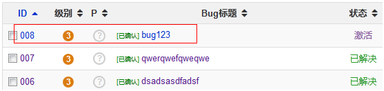

# Title: Apache+SVN+禅道

## 思路

&emsp;&emsp;研发提交bug时，在备注中注明bug的ID号、项目号。禅道会读取svn日志信息，并提取版本备注中的ID号和项目号等信息，将这些信息与具体的项目中的BUG相关连。从而确定某一bug是由谁开发、由谁完成等管理信息。如果在提交bug时，不按照禅道的备注格式书写或者不填写备注信息，禅道是无法判断某一bug是由谁负责的。

## Apache与svn融合

&emsp;&emsp;Apache与svn接合是为了让svn能够通过HTTP就可以访问。做这一步的目的，就是在禅道配置文件中可以设置通过HTTP访问SVN。

### Apache的设置

&emsp;&emsp;在配置文件中加载这两个模块，如果模块不存在，还得需要用户自己去安装相关模块，如下图所示：

&emsp;&emsp;配置SVN的HTTP访问信息，如下图：

&emsp;&emsp;至于认证方式及创建认证用户的配置网上有具体方法，而且相当简单。实验环境中，认证用户与密码我都设置成了bailitop。

## SVN的设置

&emsp;&emsp;svn仓库的创建过程此处不做赘述，网上都有具体的方法。此处的着重点是SVN与Apache在配合上的配置过程。上面提到，在配置SVN的HTTP信息时，有一配置项为AuthSVNAccessFile，此文件是所有仓库的权限管理文件，相当于每个仓库里的authz文件。而用户被存储在AuthUserFile处。下图是AuthSVNAccessFile的配置信息：

## 禅道的配置

&emsp;&emsp;首先，需要安装禅道，具体安装步骤不做叙述，此处着重于配置。打开module/svn/config.php，配置信息如下：

&emsp;&emsp;此处设置的仓库（bnw）路径为`http://svn.bailitop.com/svn/bnw/`。如果想设置多个仓库，只需要将下面的配置信息去掉注释并设置相关信息即可，如下图所示：

&emsp;&emsp;`此处注意”$i++;”是必须存在的。它代表第几个仓库。`

### 禅道的HTTP信息
&emsp;&emsp;配置信息比较简单，如下图所示：

### 初始化管理脚本
&emsp;&emsp;进入禅道的bin目录，执行./init.sh脚本（如果是windows系统的话，需要执行init.bat脚本），它会让你输入php可执行文件的绝对路径，以及禅道管理系统的域名信息。

&emsp;&emsp;查看syncsvn.sh文件内容，如下：

&emsp;&emsp;这个文件是禅道读取SVN日志信息并提取信息的脚本文件，一般把它放在定时任务里。手工执行该文件会输出日志信息，如下图：

### 部署定时任务

&emsp;&emsp;在初始化管理脚本一节中已经提到关于定时任务的信息，此处只配置具体的定时任务信息，如下所示：

## 代码提交备注信息格式

&emsp;&emsp;在【思路】里面已经提到代码提交的备注格式问题。开发者在提交svn的时候，需要在备注里面注明此次修改相关的需求，或者任务，或者bug的id。下面是具体的格式（来自官方）：
1、`bug#123,234, 1234`，也可以是`bug:123,234  1234`，id列表之间，用逗号和空格都可以。  
2、`story#123  task#123`  
bug, story, task是必须标注的（官方），具体实验过程中显示，在只有一个仓库时，story与task不是必须标注的。

## 测试

### 获取bug的ID号

&emsp;&emsp;提交完bug，返回bug页，会得到提交bug的ID号，如下图所示：

&emsp;&emsp;此处提交bug的ID号为008。

### SVN的客户端commit

&emsp;&emsp;SVN在commit时会让你输入备注信息，不输入备注的话，备注默认为空。但是禅道系统要求必须输入备注信息，要不然无法获取bug与SVN版本的对应关系。如下图所示：

&emsp;&emsp;在备注信息中输入本次提到对应的bug ID号。  
&emsp;&emsp;其次，确认解决，如下图所示：

&emsp;&emsp;上面两步完成之后，点击bug标题，即可显示该bug 对应的SVN信息，如下图所示：

