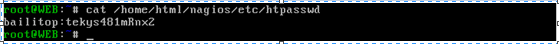

# Title: nagios的搭建过程及配置方法


## 简介

&emsp;&emsp;Nagios是一款开源的系统与网络监视工具，能有效地监控windows、linux、unix、打印机及交换机和路由器等网络设备。在系统或服务状态异常时发出邮件或短信报警第一时间通知运维人员，在状态恢复发出正常的邮件或短信通知。

**主要功能**
+ 网络服务监控（SMTP、POP3、HTTP、NNTP、ICMP、SNMP、FTP、SSH）
+主机资源监控（CPU load、disk usage、system logs），也包括Windows主机（使用NSClient++ plugin）
+ 可以指定自己编写的Plugin通过网络收集数据来监控任何情况（温度、警告……）
+ 可以通过配置Nagios远程执行插件远程执行脚本
+ 远程监控支持SSH或SSL加通道方式进行监控
+ 简单的plugin设计允许用户很容易的开发自己需要的检查服务，支持很多开发语言（shell scripts、C++、Perl、ruby、Python、PHP、C#等）
+ 包含很多图形化数据Plugins（Nagiosgraph、Nagiosgrapher、PNP4Nagios等）
+ 可并行服务检查
+ 能够定义网络主机的层次，允许逐级检查，就是从父主机开始向下检查
+ 当服务或主机出现问题时发出通告，可通过email, pager, sms 或任意用户自定义的plugin进行通知
+ 能够自定义事件处理机制重新激活出问题的服务或主机
+ 自动日志循环
+ 支持冗余监控
+ 包括Web界面可以查看当前网络状态，通知，问题历史，日志文件等

## Nagios工作原理

&emsp;&emsp;启动nagios后，它会周期性地自动调用插件去检测服务器状态，同时会维持一个队列，所有插件返回来的状态信息都进入队列，nagios每次都从队首开始读取信息，并进行处理，之后把状态结果通过web显示出来。
**四种监控状态**


&emsp;&emsp;nagios的安装只是一个监控体系的框架，也就是所有监控的基础，所有的功能都是通过插件来实现的，它通过周期性地调用插件来检测服务状态。它们之间的关系如图所示：


&emsp;&emsp;nagios系统还提供了一个插件NRPE，通过周期性地运行它来获得远端服务器的各种状态信息。NRPE的工作原理如图所示：


## nagios服务器的搭建

基础支持套件：gcc glibc glibc-common gd gd-devel xinetd openssl-devel  
如果系统中没有这些套件，使用yum安装它们即可。
源码安装nagios时，默认会创建一个用户nagios和用户组nagios，如果不想让它创建，那么咱们可以自己指定一个已存在的用户名和用户组。如果想创建自己的用户和用户组，可以参考下面的命令：
```shell
mkdir /usr/local/nagios
useradd -d /usr/local/nagios -s /sbin/nologin nagios
chown -R nagios:nagios /usr/local/nagios
```
### 编译安装nagios

```shell
mkdir –p /home/html/nagios
chown –R apache:apache /home/html/nagios
tar zxf  nagios-4.0.6.tar.gz
cd  nagios-4.0.6
./configure –prefix=/home/html/nagios –with-nagios-user=apache –wich-nagios-group=apache
```
编译nagios时，选项--with-nagios-user、--with-nagios-group分别表示nagios使用的用户和用户名，--prefix表示用户自定义的安装目录，如果有更多的需求，只需要在执行configure时加上--help即可查看所有的选项及说明。


运行完上面configure命令后，如下图所示：


```shell
make all
```

```shell
make install
```

```shell
make install-init
```

```shell
make install-commandmode
```

```shell
make install-config
```


### 验证程序是否正确安装

&emsp;&emsp;执行完上面的步骤后，nagios监控框架就已经安装完成了，接下来要做的就是查看程序是否正确地安装。


|bin	|Nagios可执行程序所在目录|
|------|----------------------------------|
|etc	|Nagios配置文件所在目录|
|sbin	|Nagios CGI文件所在目录，也就是执行外部命令所需文件所在的目录|
|share	|Nagios网页文件所在的目录|
|libexec	|Nagios外部插件所在目录|
|var	|Nagios日志文件、lock等文件所在的目录|
|var/archives|	Nagios日志自动归档目录|
|var/rw|	用来存放外部命令文件的目录|

### 安装nagios插件

安装完nagios框架后，接下来要安装的是nagios插件，插件向nagios提供了功能。
```shell
tar zxf nagios-plugins-2.0.3.tar.gz
cd nagios-plugins-2.0.3
./configure –prefix=/home/html/nagios  --with-nagios-user=apache  --with-nagios-group=apache
```


### 配置apache

找到apache的配置文件/etc/httpd/conf/httpd.conf
找到：
```shell
User  apache
Group apache
```
把用户名和用户组替换为nagios所使用的用户名和用户组，之前nagios使用的用户名和用户组都是apache，所以在这里就不用修改了。  
为了安全起见，一般情况下要让nagios的web监控页面必须经过授权才能访问，这需要增加验证配置，即在httpd.conf文件中添加如下信息：
```shell
#setting for nagios 
ScriptAlias /nagios/cgi-bin "/home/html/nagios/sbin" 
<Directory "/home/html/nagios/sbin">
     AuthType Basic 
     Options ExecCGI 
     AllowOverride None 
     Order allow,deny 
     Allow from all 
     AuthName "Nagios Access" 
AuthUserFile /home/html/nagios/etc/htpasswd             #htpasswd用于此目录访问身份验证的文件 
     Require valid-user 
</Directory>
Alias /nagios "/home/html/nagios/share" 
<Directory "/home/html/nagios/share">
     AuthType Basic 
     Options None 
     AllowOverride None 
     Order allow,deny 
     Allow from all 
     AuthName "nagios Access" 
     AuthUserFile /home/html/nagios/etc/htpasswd 
     Require valid-user 
</Directory>
```

### 创建apache目录验证文件

在上面的配置过程中，我们指定了目录验证文件htpasswd，接下来要创建该文件：


创建完后，接下来查看一下该验证文件，打开/home/html/nagios/etc/htpasswd查看它的内容如下：



### 启动apache

到这里nagios监控系统就基本上完成安装了，目前只能监控远程服务、本地服务及本地服务器性能，还不能远程监控远程服务器的性能，如果想监控远程服务器的性能，只需要在远程服务器安装nrpe和nagios的插件即可。  
完成以上操作后，接下来就测试一下nagiuos。首先启动apache服务器，之后访问：


##  配置nagios

&emsp;&emsp;nagios主要用于监控一台或者多台本地主机及远程的各种信息，包括本机资源及对外的服务等。默认的nagios配置没有任何监控内容，仅是一些模板文件。若要让nagios提供服务，就必须修改配置文件，增加要监控的主机和服务。

### 默认配置文件介绍

Nagios安装完成后，默认的配置文件在/home/html/nagios/etc/目录下：


每个文件或目录的含义如下表所示：
  
|Cgi.cfg	|控制CGI访问的配置文件|
|------------|------------------------------|
|Nagios.cfg	|Nagios主配置文件|
|Resource.cfg	|变量定义文件，在这些文件中定义变量，以便由其他配置文件引用，如$USER1$|
|Objects	|Objects是一个目录，在此目录下有很多配置文件模板，用于定义nagios对象|
|Objects/commands.cfg	|命令定义配置文件，其中定义的命令可以被其他配置文件引用|
|Objects/contacts.cfg|	定义联系人和联系人组的配置文件|
|Objects/localhost.cfg|	定义监控本地主机的配置文件|
|Objects/printer.cfg|	定义监控打印机的一个配置文件模板，默认没有启用此文件|
|Objects/switch.cfg	|定义监控路由器的一个配置文件模板，默认没有启用此文件|
|Objects/templates.cfg|	定义主机和服务的一个模板配置文件，可以在其他配置文件中引用|
|Objects/timeperiods.cfg	|定义nagios监控时间段的配置文件|
|Objects/windows.cfg|	监控windows主机的一个配置文件模板，默认没有启用此文件|

### 配置文件之间的关系

在nagios的配置过程中涉及到的定义有主机、主机组、服务、服务组、联系人、联系人组、监控时间、监控命令等，从这些定义可以看出，nagios各个配置文件之间是互为关联的，彼此引用的。如果想成功配置一台nagios监控系统，必须要弄清楚每个配置文件之间的依赖与被依赖的关系，最重要的有四点：  

1.定义监控哪些主机、主机组、服务和服务组  
2.定义这个监控要用什么命令  
3.定义监控的时间段  
4.定义主机或服务出现问题时要通知的联系人和联系人组。

### Nagios的配置

为了能更清楚地说明问题，同时也为了维护的方便，建议将nagios各个定义对象创建独立的配置文件：

+ 创建hosts.cfg文件来定义主机
+ 创建services.cfg文件来定义服务
+ 用默认的contacts.cfg文件定义联系人和联系人组
+ 用默认的commands.cfg文件来定义命令
+ 用默认的timeperiods.cfg来定义监控时间段
+ 用默认的templates.cfg文件作为资源引用文件

#### Templates.cfg文件

Nagios主要用于监控主机资源以及服务，在nagios配置中称为对象，为了不必重复定义一些监控对象，nagios引入了一个模板配置文件，将一些共性的属性定义成模板，以便于多次引用，这就是templates.cfg的作用。  
下面详细介绍下templates.cfg文件中每个参数的含义：  
由于templates.cfg文件中每个参数的含义都是有定义的，只是全英文而已，下面所列出的只是拿其中的一个作为例子。  
```shell
define contact{
name     generic-contact    ; 联系人名称
     service_notification_period     24x7 
; 当服务出现异常时，发送通知的时间段，这个时间段"24x7"在timeperiods.cfg文件中定义
      host_notification_period        24x7 
; 当主机出现异常时，发送通知的时间段，这个时间段"24x7"在timeperiods.cfg文件中定义
    service_notification_options    w,u,c,r  
; 这个定义的是“通知可以被发出的情况”。w即warn，表示警告状态，u即unknown，表示不明状态 ; c即criticle，表示紧急状态，r即recover，表示恢复状态; 也就是在服务出现警告状态、未知状态、紧急状态和重新恢复状态时都发送通知给使用者。
  host_notification_options       d,u,r 
; 定义主机在什么状态下需要发送通知给使用者，d即down，表示宕机状态; u即unreachable，表示不可到达状态，r即recovery，表示重新恢复状态。
     service_notification_commands   notify-service-by-email 
; 服务故障时，发送通知的方式，可以是邮件和短信，这里发送的方式是邮件 ; 其中“notify-service-by-email”在commands.cfg文件中定义。
        host_notification_commands      notify-host-by-email   
 ; 主机故障时，发送通知的方式，可以是邮件和短信，这里发送的方式是邮件 ; 其中“notify-host-by-email”在commands.cfg文件中定义。 
       register                        0       
 }
```

#### Resouces.cfg文件

```shell
$USER1$=/home/html/nagios/libexec
```
其中，变量$USER1$指定了nagios插件的安装路径，如果把插件安装在了别的地方，只需要在这里进行修改即可。  

####  Commands.cfg文件

此文件默认是存在的，无需修改即可使用，如果有新的命令需要加入时，在此文件进行添加即可。它的格式如下： 
```shell
define command{
command_name    check_local_load
command_line    $USER1$/check_load -w $ARG1$ -c $ARG2$
}
```

对于上面变量的使用规则，可以搜索“nagios  命令参数宏”，网上会有它的相关信息，也可以参考下文的“nagios命令参数”。
##### Hosts.cfg文件

此文件默认不存在，需要手动创建，hosts.cfg主要用来指定被监控的主机地址以及相关属性信息。它的格式如下：

```shell
define host{   
        use     linux-server        
#引用主机linux-server的属性信息，linux-server主机在templates.cfg文件中进行了定义。
        host_name       Nagios-Linux          #主机名
        alias           Nagios-Linux          #主机别名
        address        192.168.0.30         #被监控的主机地址，这个地址可以是ip，也可以是域名。
        }  
```

####  Services.cfg文件
此文件默认也不存在，需要手动创建，services.cfg文件主要用于定义监控的服务和主机资源，例如http服务，磁盘空间，主机系统负载等等。
```shell
define service{  
        use           local-service
#引用local-service服务属性值，local-service在templates.cfg文件中进行了定义。
    host_name       Nagios-Linux          
#指定要监控哪个主机上的服务，“Nagios-Server”在hosts.cfg文件中进行了定义。
        service_description     check-host-alive       
#对监控服务内容的描述，以供维护人员参考。
 check_command      check-host-alive      
#指定检查的命令。
    }  

##### Cgi.cfg文件

此文件用来控制相关cgi脚本，如果想在nagios的web监控界面执行cgi脚本，例如重启nagios进程，关闭nagios通知等等，这时就需要配置cgi.cfg文件。由于nagios的web监控界面验证用户为bailitop，所以只需在cgi.cfg文件中添加此用户的执行权限就可以了，需要修改的配置信息如下：

```shell
default_user_name=bailitop
authorized_for_system_information=nagiosadmin,bailitop
authorized_for_configuration_information=nagiosadmin,bailitop
authorized_for_system_commands=bailitop
authorized_for_all_services=nagiosadmin,bailitop
authorized_for_all_hosts=nagiosadmin,bailitop
authorized_for_all_service_commands=nagiosadmin,bailitop
authorized_for_all_host_commands=nagiosadmin,bailitop
```
#### Nagios文件

nagios.cfg是nagios的核心配置文件，所有的对象配置文件都必须在这个文件中进行定义才能发挥其作用，这里只需将对象配置文件在nagios.cfg文件中引用即可。
```shell
cfg_file=/home/html/nagios/etc/objects/hosts.cfg
cfg_file=/home/html/nagios/etc/objects/services.cfg
status_update_interval=10    
# 该变量用于定义状态文件（即status.dat）的更新时间间隔，单位是秒，最小更新间隔是1秒。
nagios_user=nagios   # 该变量指定了Nagios进程使用哪个用户运行。
nagios_group=nagios 
```

#### 配置实例

配置实例主要是用于说明配置文件之间的关系，通过实例使得更容易理解上边所说的。
**监控一个主机**


**定义一个服务**


**定义一个命令**


以上三个是彼此相互引用的，监控主机时需要指明要监控的服务，它们之间是通过host_name联系在一起的，要监控服务，就得指定要使用的命令，定义的命令与服务之间是通过command_line联系在一块的。  

### 验证nagios配置文件的正确性

Nagios在验证配置文件方面做的非常到位，只需通过一个命令即可完成：

```shell
/home/html/nagios/bin/nagios –v /home/html/nagios/etc/nagios.cfg
```

## 监控远程主机的“本地信息”

通过nagios提供的插件只能监控到网络服务，比如http，ping，ssh，ftp等，以及本地的信息，比如cpu使用率，进程数，内存使用情况，磁盘使用情况等。要想使nagios也能监控到远程服务器的“本地信息”，就得借助NRPE服务，其原理如图： 


Check_nrpe是nagios提供的一个插件，NRPE守护进程运行在被监控主机上，用于接收从check_nrpe传过来的数据请求。
整个监控过程如下：

+ Nagios 会运行check_nrpe 这个插件，告诉它要检查什么
+ check_nrpe 插件会连接到远程的NRPE daemon，所用的方式是SSL
+ NRPE daemon 会运行相应的Nagios 插件来执行检查
+ NRPE daemon 将检查的结果返回给check_nrpe 插件，插件将其递交给nagios做处理。

### 在被监控主机上安装NRPE守护进程

解压nrpe


运行configure，默认路径安装在/usr/local/nagios，用户及用户组为nagios


```shell
make all 
```


```shell
make install-plugin（被监控机不需要这个，安装它只是为了进行本地测试）
```


```shell
 make install-daemon（安装NRPE的守护进程）
```


```shell
 make install-daemon-conf（安装NRPE配置文件）
```


### 配置NRPE配置文件

打开配置文件/usr/local/nagios/etc/nrpe.cfg，查看默认的配置，如下


其中中括号里的东西就是命令名，也就是check_nrpe 的-c 参数可以接的内容，等号 “=” 后面是实际执行的插件程序。例如：请求check_users 命令的时候，其实就是运行等号后面/usr/local/nagios/libexec/check_users -w 5 -c 10 的命令。如果要定义自己的命令，只需要遵从它的格式就可以了。  
### 启动NRPE守护进程

启动NRPE守护进程只需要运行命令：
```shell
/usr/local/nagios/bin/nrpe  -c /usr/local/nagios/etc/nrpe.cfg  -d
```
其中-d表示daemon，-c表示指定配置文件。如果重新修改了配置文件，需要重新启动守护进程。

### 在被监控机上安装nagios插件

安装完NRPE之后，基本上就完成了nagios监控远程系统的任务，但是有些命令插件默认是不存在的，需要在被监控机上安装nagios插件，具体如何安装，请参考上面的nagios插件的安装过程

### 配置监控主机使它监控被监控主机

在监控主机的commands.cfg中增加对check_nrpe的定义，如下图：


-c 后面带的$ARG1$参数是传给NRPE damon执行的检测命令，在services.cfg中使用check_nrpe的时候要用”!”作为分隔符。  

