# Title: varnish的安装与配置


## 概要

&emsp;&emsp;varnish是一个cache型的HTTP反向代理，它采用全新的软件体系结构和现在的硬件体系配置比较紧密，这使得它的稳定性很好。varnish采用了visual page cache技术，所有缓存的数据都直接从内存读取，而流行的squid则从硬盘读取缓存的数据，因此varnish在访问速度上更快些。由于varnish的TCP连接与释放比squid快，所以在高并发连接情况下可以支持更多的TCP连接。但它也有自己的缺点，在高并发情况下，CPU、I/O和内存资源开销高于squid，一旦varnish重启，缓存的数据都会从内存中释放掉。

## varsh的工作流程

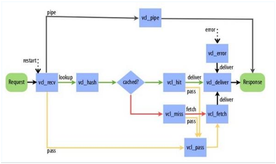

`1.varnish从客户端接收请求后，由vcl_recv状态引擎处理，不能识别的请求将会通过参数pipe交给vcl_pipe状态引擎，需要查找缓存的请求通过lookup参数将会交`  
`给vcl_hash状态引擎，无需缓存的数据通过参数pass将会交给 vcl_pass状态引擎。`  
`2.vcl_hash状态引擎在接收到请求后会从缓存中查找数据，查询结果有两种，一种是hit缓存命中，另一种是miss缓存未命中`  
`3.vcl_hit状态引擎将命中的缓存数据通过参数deliver交给vcl_deliver状态引擎，vcl_deliver状态引擎将数据处理后，最终返回给客户端`  
`4.vcl_miss状态引擎将未命中的结果参数fetch交给vcl_fetch状态引擎，vcl_fetch状态引擎将会从数据库中查找数据`  
`5.vcl_fetch状态引擎将从数据库中查询到的结果，返回给vcl_deliver状态引擎`  
`6.vcl_deliver状态引擎将结果返回给master进程，最终返回给客户端`  

## varnish子程序

&emsp;&emsp;varnish的子程序在default.vcl中有默认的配置，如果重新配置了某一个功能，并不意味着默认的动作一定不会执行。一般情况下，如果重新配置了某一个功能，但是没有返回值，varnish将会执行默认的动作，因为所有的varnish子程序都会有一个返回值。这可以看作是一种容错机制。  
&emsp;&emsp;第一个子程序是”vcl_recv”，在收到完整的客户端请求后开始执行这个子程序，可以通过修改req对象来改变默认的请求处理，varnish根据返回值决定处理方式。比如，返回：pass，将使varnish直接转发请求到web服务器，返回：lookup，将使varnish检查缓存。  
&emsp;&emsp;下一个子程序是vcl_pass，如果在vcl_recv中返回了”pass”，将执行vcl_pass。Vcl_pass有两种返回值，pass：继续转发请求到后端web服务器；restart：将请求重新返回给vcl_recv。  
&emsp;&emsp;vcl_miss和vcl_hit将会根据varnish的缓存命中情况来执行。Vcl_miss的执行有两种情况，一种是从后端服务器获取响应结果，并且在本地缓存（fetch），二是从后端获取到响应，但本地不缓存（pass）。如果varnish缓存命中，将会执行vcl_hit，它也会有两个选择，一个直接将缓存的结果返回给客户端（deliver），二是丢弃缓存，重新从后端服务器获取数据（pass）。当从后端服务器获取到数据之后，将会执行vcl_fetch过程，在这里可以通过beresp对象来访问响应数据，返回两种处理结果：deliver：按计划将数据发送给客户端；restart：退回这个请求。  
&emsp;&emsp;在vcl_deliver子程序中，可以将响应结果发送给客户端（deliver），结束这个请求，同时根据不同情况决定是否缓存结果。也可以返回”restart”值，来重新开始这个请求。  
&emsp;&emsp;每个子程序在处理过程中只能使用特定的几个对象，下面两张表是子程序各数据对象的可用情况及合法返回值。  

**各子程序中各数据对象的可用情况**
<table>
    <tr>
        <td></td>
        <td>client </td>
        <td>server </td>
        <td>req </td>
        <td>bereq </td>
        <td>beresp </td>
        <td>resp </td>
        <td>obj </td>
    </tr>
    <tr>
        <td>vcl_recv </td>
        <td>x </td>
        <td>x </td>
        <td>x </td>
        <td></td>
        <td></td>
        <td></td>
        <td></td>
    </tr>
    <tr>
        <td>vcl_pass </td>
        <td>x </td>
        <td>x </td>
        <td>x </td>
        <td>x </td>
        <td></td>
        <td></td>
        <td></td>
    </tr>
    <tr>
        <td>vcl_miss </td>
        <td>x </td>
        <td>x </td>
        <td>x </td>
        <td>x </td>
        <td></td>
        <td></td>
        <td></td>
    </tr>
    <tr>
        <td>vcl_hit </td>
        <td>x </td>
        <td>x </td>
        <td>x </td>
        <td></td>
        <td></td>
        <td></td>
        <td>x </td>
    </tr>
    <tr>
        <td>vcl_fetch </td>
        <td>x </td>
        <td>x </td>
        <td>X </td>
        <td>x </td>
        <td>x </td>
        <td></td>
        <td></td>
    </tr>
    <tr>
        <td>vcl_deliver </td>
        <td>x </td>
        <td>x </td>
        <td>x </td>
        <td></td>
        <td></td>
        <td>x </td>
        <td></td>
    </tr>
    <tr>
        <td></td>
    </tr>
</table>

**各子程序的合法返回值**

<table>
    <tr>
        <td></td>
        <td>pass </td>
        <td>lookup </td>
        <td>error </td>
        <td>restart </td>
        <td>deliver </td>
        <td>fetch </td>
        <td>pipe </td>
        <td>hit_for_pass </td>
    </tr>
    <tr>
        <td>vcl_recv </td>
        <td>x </td>
        <td>x </td>
        <td>x </td>
        <td></td>
        <td></td>
        <td></td>
        <td>x </td>
        <td></td>
    </tr>
    <tr>
        <td>vcl_pass </td>
        <td>x </td>
        <td></td>
        <td>x </td>
        <td>x </td>
        <td></td>
        <td></td>
        <td></td>
        <td></td>
    </tr>
    <tr>
        <td>vcl_lookup </td>
        <td></td>
        <td></td>
        <td></td>
        <td></td>
        <td></td>
        <td></td>
        <td></td>
        <td></td>
    </tr>
    <tr>
        <td>vcl_miss </td>
        <td>x </td>
        <td></td>
        <td>x </td>
        <td></td>
        <td></td>
        <td>x </td>
        <td></td>
        <td></td>
    </tr>
    <tr>
        <td>vcl_hit </td>
        <td>x </td>
        <td></td>
        <td>x </td>
        <td>x </td>
        <td>x </td>
        <td></td>
        <td></td>
        <td></td>
    </tr>
    <tr>
        <td>vcl_fetch </td>
        <td></td>
        <td></td>
        <td>x </td>
        <td>x </td>
        <td>x </td>
        <td></td>
        <td></td>
        <td>x </td>
    </tr>
    <tr>
        <td>vcl_deliver </td>
        <td></td>
        <td></td>
        <td>x </td>
        <td>x </td>
        <td>x </td>
        <td></td>
        <td></td>
        <td></td>
    </tr>
    <tr>
        <td></td>
    </tr>
</table>

## VCL内置公共变量

VCL内置的公共变量可以用在不同的VCL函数中，下面根据使用的阶段进行介绍
当请求到达时，可以使用公共变量表1所示：  

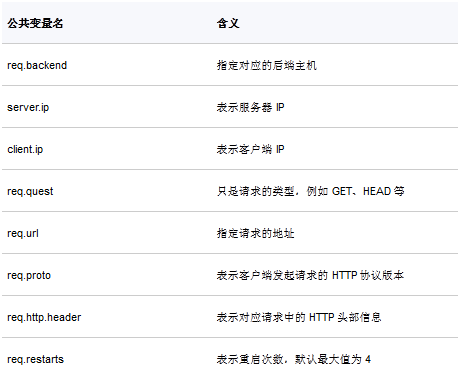

Varnish向后端主机请求时，可以使用公共变量表2所示：  

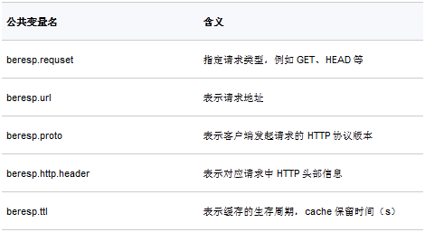

从cache或者后端主机获得数据后，可以使用公共变量3所示：  

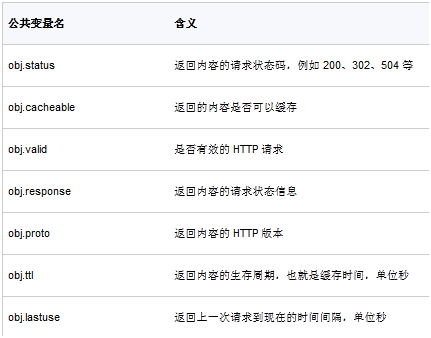

对客户端的应答时，可以使用公共变量表4所示：  

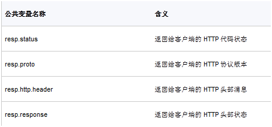

## 安装过程

安装过程很简单，同样需要执行三步configure、make、make install。此次安装过程分为下面三步：  
```shell
# ./configure  --prefix=/usr/local/varnish
# make
# make  install 
```
在安装过程中有可能遇到的问题请参考常见问题及解决方法。  
安装完成后，接下来就是copy配置文件：  

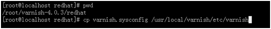
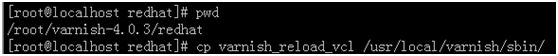

接下来要做的就是修改启动脚本/etc/init.d/varnish，如下图所示：

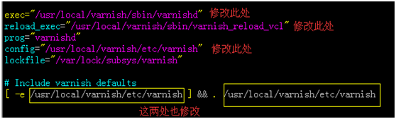

## 配置varnish

此次配置是varnish与web在同一台机器上，只是它们使用不同的端口号而已。修改/usr/local/varnich/etc/varnish，配置如下参数：  
修改主配置文件路径地址


修改varnish监听端口号


修改varnish缓存的空间大小

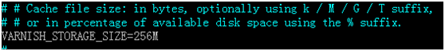

配置后端的主机地址及端口号

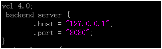

配置vcl_recv

如果请求方式不是GET、HEAD、PUT等，那么就把请求提交到PIPE模式

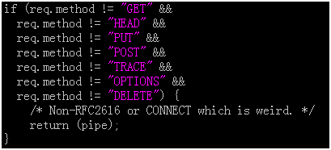

如果请求方式不是GET和HEAD，那么就将它提交给PASS模式。

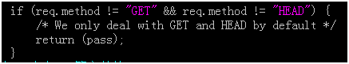

清除URL中有JPG等文件请求头的cookie信息

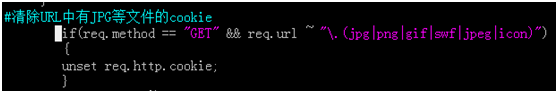

将动态脚本直接提交给PASS模式

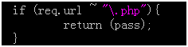

配置vcl_deliver

如果在缓存中命中，响应头中增加命中信息，数字1表示命中，数字0表示未命中

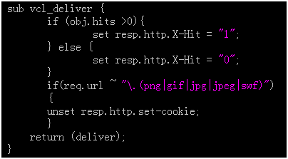
 
## 启动脚本

如果启动失败，可以注释/etc/init.d/varnish的一句代码，再启用时它会报出哪儿出现了问题，如下图：


启动脚本
```shell
# /etc/init.d/varnish  start
```
## 测试

使用python对搭建的varnish进行测试，部分代码如下：

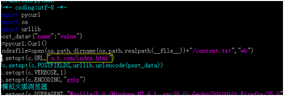

### 开启压缩后varnish缓存前与缓存后的对比

当第一次执行这个代码时，结果如图所示：

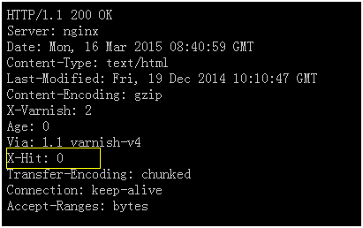

X-Hit为零时表示未命中。当未命中时，文件传输的总时间为22.728毫秒，如下图所示：

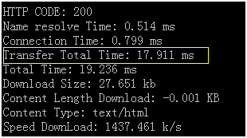

当第二次执行这个代码时，X-Hit为1表示命中，而传输时间则降为4.437毫秒，性能提升了4倍，结果如下图：

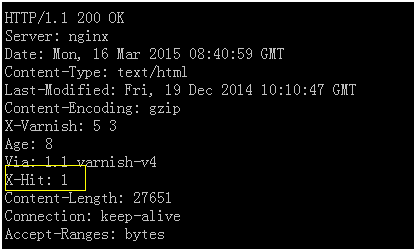

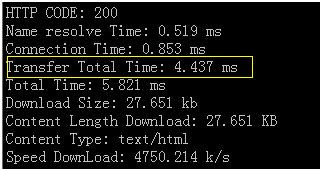

### 未启用压缩时varnish缓存前与缓存后的对比

下面这张图是未缓存时，它的传输时间是18.859毫秒，而另一张图是缓存后的传输时间，两者相差并不大。

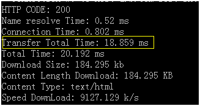

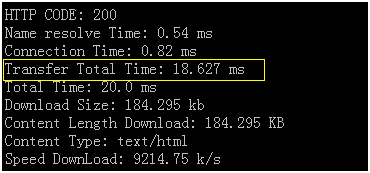

### Nginx代理与varnish代理的对比

此次实验是在被测试机上进行的，使用apache经典的负载测试工具ab。如果我们把并发设为1，总量设为1，就可以测出单条请求的处理数据信息，下面是未使用任何代理时测出来的数据，从图中可以看出每秒最大能够处理的请求数为2754.82个。  

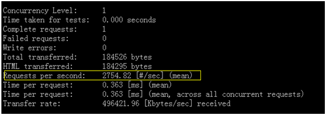

### 使用nginx代理的性能测试

使用nginx代理后端web服务时，对单条请求数据进行测试，结果下图，从图中可以看出通过nginx代理后每秒最大处理请求数是51.4个。为什么会相差那么大？那是因为每次请求都要通过代理，由代理将请求转发到后端，后端返回数据后再由代理转发给用户。  

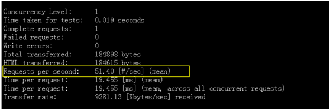

### 使用varnish代理的性能测试

使用varnish代理后端数据时，在未缓存任何数据时进行测试，结果如下图所示，它每秒最大处理的请求数是63.46个，比使用nginx代理后端服务的处理能力提高了10个。  

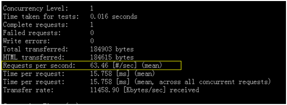

再次对相同的URL进行请求，结果如下图，发现处理能力由63.46提升到568.18个。原因是什么呢？这是由于第一次请求时未缓存页面，varnish将请求转发到后端服务，后端服务将结果返回给varnish，varnish除了将数据返回给用户之外，还将数据缓存起来。当相同的请求再次进来时，varnish在缓存中找到数据就直接将数据返回给用户而不需要再次向后端服务去请求，从而提升了处理性能。  

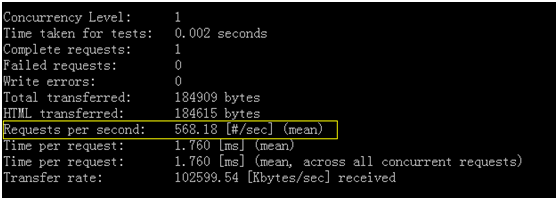

## 常见问题及解决方法

1、no package ‘libpcre’ found  
首先确认一下pcre，pcre-devel安装了没有，如果安装了还出现这个问题，就是PKG_CONFIG_PATH路径的问题了，在64位centos下，在命令行下输入：
```shell
 export  PKG_CONFIG_PATH=/usr/lib64/pkgconfig
```
之后再执行configure就没问题了。

## 参考资料
1、[Linux下Varnish缓存的配置优化](http://www.cnblogs.com/glory-jzx/archive/2012/09/11/2679857.html)  
2、[Varnish 缓存服务器调优](http://www.newasp.net/tech/67850.html)  
3、[高性能缓存服务器Varnish解析](http://www.programmer.com.cn/14315/)  
4、[使用 Varnish 加速你的 Web 网站](http://www.oschina.net/translate/speed-your-web-site-varnish)  
5、[varnish安装配置](http://blog.slogra.com/post-139.html)  
6、[ varnish配置详解](http://blog.csdn.net/keda8997110/article/details/8777153)  
7、[高性能HTTP加速器varnish](http://www.cnblogs.com/littlehb/archive/2012/02/12/2347768.html)


