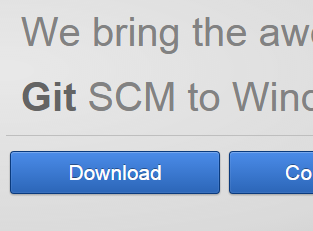
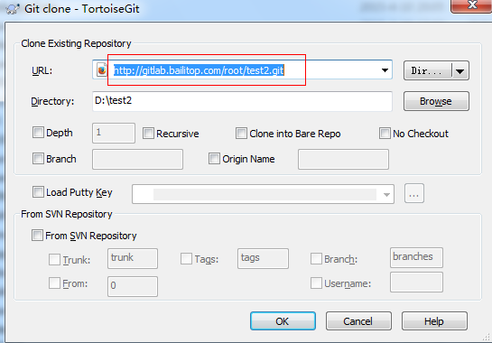

# Title: Git-Windows客户端的安装与使用

## 安装git
**1、下载 [Git for Windows](http://msysgit.github.io/) 最新版即可，如下：**

**2、点击安装，选择默认即可。**  

**3、安装完成**  

## 安装TortoiseGit

**1、下载 [TortoiseGit](http://download.tortoisegit.org/tgit/) 客户端**  

**2、检出项目(使用HTTP协议）**  
&emsp;&emsp;使用http协议比较简单，不需要额外的配置，直接检出即可，如下图所示：  

**3、其右健操作与TortoiseSVN一样**  

