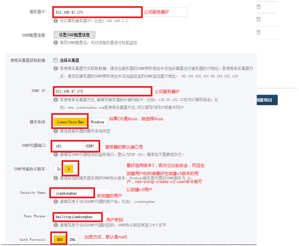
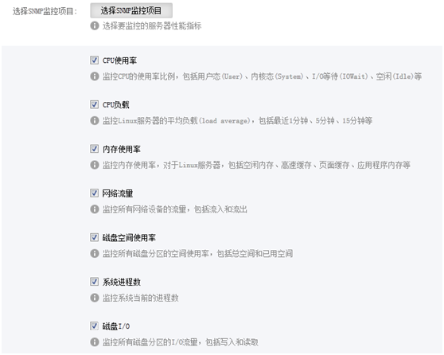
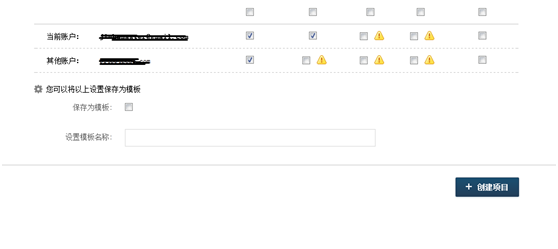

# Title: 配置监控宝监控服务器性能


## 概述

&emsp;&emsp;监控宝之所以可以监控服务器的性能是因为它使用的是snmp协议，使用的是udp传输通道，端口号是161（默认）。  
&emsp;&emsp;本文就如何配置snmp，以及如何在监控宝开启这些功能等问题进行如何操作记录。系统环境是centos 6.5  64位操作系统。

## 安装net-snmp和net-snmp-utils

### 使用yum安装
使用yum安装的优点就是不需要对源码进行重新编译即可安装，操作简便。安装命令如下：
```shell
yum  install  -y  net-snmp  net-snmp-utils  net-snmp-devel
```

## 添加v3用户

> net-snmp-create-v3-user回车  
输入用户名，比如jiankongbao，回车  
输入密码，比如bailitopjiankongbao，回车  
再次输入密码，直接回车表示使用刚才输入的密码。  
完成之后，打开文件/etc/snmp/snmpd.conf，在最后会发现一句：rwuser  jiankongbao  

## 配置监控宝

1、选择“创建监控项目”  
2、填写相关内容，如图1所示：


<center>**图1**</center>

3、选择监控项目，如图2所示：


<center>**图2**</center>

4、最后点击创建项目即可


<center>**图3**</center>


