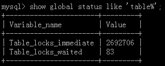
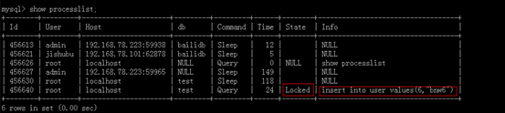
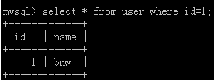
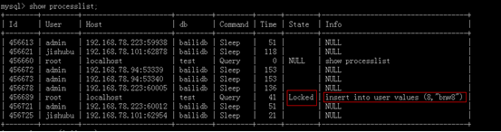

# Title: Mysql MyISAM锁机制

## 概述
&emsp;&emsp;锁是计算机协调多个进程或线程并发访问某一资源的机制。在数据库中，数据也是许多用户共享的资源。如何保证数据并发访问的一致性、有效性是所有数据库必须解决的一个问题。因此，锁冲突也是影响数据库并发访问性能的一个重要因素。本文档着重讨论MyISAM锁机制。  
&emsp;&emsp;相对其他数据库而言，MySQL的锁机制比较简单，其最显著的特点是不同的存储引擎支持不同的锁机制。比如MyISAM采用的是表级锁，而InnoDB既支持行级锁也支持表级锁（默认情况下采用行级锁）。
+ 表级锁：开锁小、加锁快，不会出现死锁，锁定粒度大，发生锁冲突的概率最高，并发度最低
+ 行级锁：开锁大、加锁慢，会出现死锁，锁定粒度最小，发生锁冲突的概率最低，并发度也最高

## MyISAM表锁
&emsp;&emsp;MyISAM存储引擎只支持表锁，不支持事务。随着应用对事务完整性和并发性要求的不断提高，MySQL才开始开发基于事务的存储引擎。  
&emsp;&emsp;MySQL表锁定的原理如下：对于write，如果在表上没有锁，mysql就在它上面放一个写锁，否则就把锁定请求放在写锁队列中；对于read，如果在表上没有写锁，就把一个读锁放在它上面，否则就把锁请求放在读锁队列中。  
&emsp;&emsp;MyISAM的读锁是共享锁，也就是不会阻塞其他用户对用一表的读请求，但会阻塞对同一表的写请求；而MyISAM的写锁是排他锁，它会阻塞其他用户对同一表的读和写操作。当一个线程获得对一个表的写锁后，只有持有锁的线程可以对表进行更新操作，其他线程的读、写操作都会等待，直到锁被释放为止。  
### 查询表级锁争用情况 
  
如果table_locks_waited的值比较高，则说明存在着较严重的表级锁争用情况。  
### 如何加表锁 
&emsp;&emsp;MyISAM在执行查询语句前会自动给涉及的所有表加读锁，在执行更新操作（update，delete，insert等）前会自动给涉及的表加写锁，这个过程并不需要用户干预，因此，用户一般不需要直接用LOCK TABLE命令给MyISAM表显式加锁。本文中的示例，基本上都是为了演示而已。  
**写锁**  
给表user加上写锁   
   
新开一个会话窗口执行插入操作，结果被阻塞了，效果如下：  
   
查询processlist，查看结果如下：  
  
**读锁**  
给表user加上读锁  
  
新开一个会话窗口执行查询操作，并没有被阻塞，结果如下：  
  
而执行一个插入操作时，就被阻塞了，效果如下：  
  
查询processlist，结果如下：  
  
## MyISAM的锁调度
&emsp;&emsp;MyISAM存储引擎的读锁和写锁是互斥的。如果一个进程请求某个MyISAM表的读锁，同时另一个进程也请求同一张表的写锁，MySQL如何处理呢？答案就是：写进程先获得锁，即使读请求先到锁队列，而写请求后到，写锁也会插到读锁请求的前面。这是因为MySQL认为写请求一般比读请求更重要，这也正是MyISAM表不太适合于有大量更新操作且查询操作的原因。

