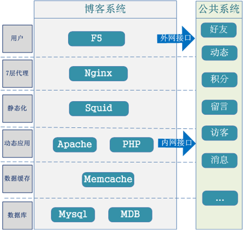
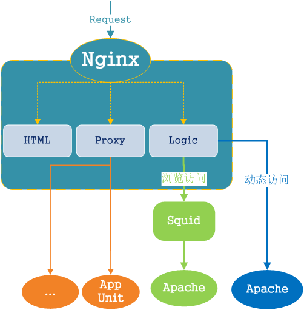
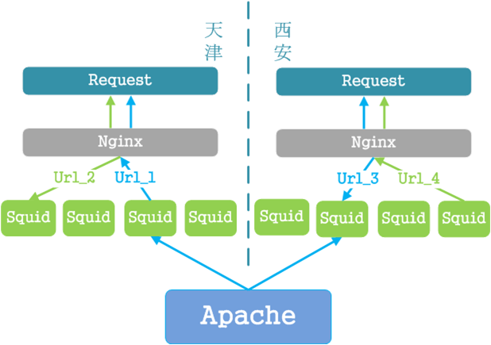
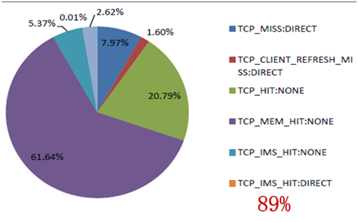
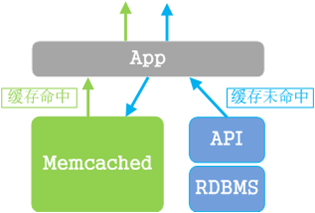
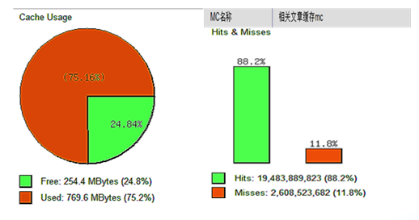
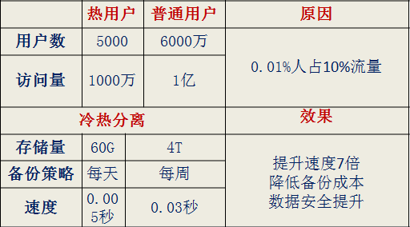
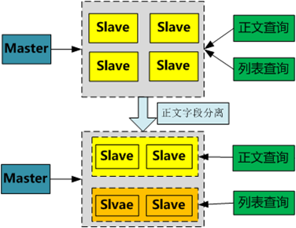

# Title: 新浪博客架构分享

Author: 刘晓震（新浪产品部技术团队成员）

## 新浪博客介绍
新浪博客是国内知名的博客服务，拥有高访问流量的Web2.0动态应用类网站。
+ \> 5年
+ 千万级用户
+ 几十亿数据记录
+ 十亿级PV/日
+ 亿级动态请求数/日

## 挑战
**博客应用特点:**  
+ 亿级访问
+ 读多写少
+ 热点用户
+ 富媒体

**挑战:**
+ 高访问量
+ 用户体验
+ 性能监控

## 博客架构介绍

**系统层次**

**七层代理**
+ Nginx 
 + 多IDC部署 
 + HTML文件服务
 + 代理服务
 + Squid管理

**静态化**
+ Squid
 + 与Nginx对等部署
 + 反向代理
 + 静态缓存服务

**静态缓存**
+ 缓存原则
 + 数据内容类型及渲染方式
 + 页面生成成本
 + 访问量和命中率
 + 更新复杂度
+ 缓存命中率优化
 + 减少冗余存储
 + 忽略no-cache
 + 良好的URL设计
 + 区分访问者和访问类型

**动态应用层**

+ Apache+PHP组成Web服务单元
 + 环境统一 配置和管理
 + 按业务功能划分服务模块
 + 代码一致且同步上线
 + 可快速扩展
+ 基于Memcacheq的消息队列系统
 + 扩展消息格式 
 + 异常处理
 + 伸缩性

**数据缓存**
+ Memcached
+ 缓存类型
 + 共享内存数据
 + 结果数据
 + 热点
 + 索引、聚合数据

+ 缓存管理
 + 设计
 + 容量
 + 命中率

**数据层**

+ Mysql数据库承担核心业务
 + 关系查询
 + 数据存储
+ MemcacheDB作为KV存储
 + 数据结构简单
 + 高并发读写
 + 可扩展能力强

+ Mysql
 + 冷热分离

 + 大字段剥离

 + 简单使用 

## 性能监控

+ 前端监控
 + 基调系统
 + RiaDebug
+ 后端监控
 + Xdebug
 + back日志
 + Syslog
+ 系统监控

## 展望

+ 数据访问层--DAL
+ 接口请求合并--SSI
+ 缓存系统简化--Redis
+ 开放、结合--OpenAPI

