# Title: NoSQL之mongodb的研究报告


## master-slave架构
### 实验环境
+ 操作系统：centos
+ master服务器IP：192.168.0.30
+ slave服务器IP：192.168.78.235

### 过程
192.168.0.30要想成为master，只需要在启动mongod时加上master参数即可，如下图所示

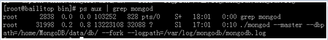

查看name collection里的内容，如下：

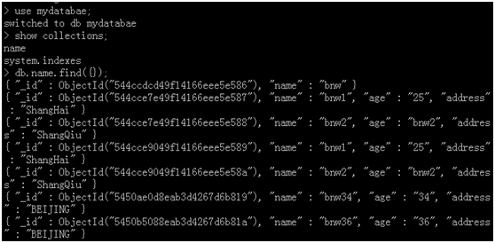

192.168.78.235要想成为slave，只需要在启动mongod时加上slave参数，同时使用source指定master的地址与端口，如下图所示：

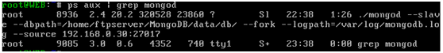

在192.168.78.235上查看name  collection里的内容，如下：


可以看到数据已经同步过来了。由以上配置可以看出，mongodb的master-slave架构模式，之间并没有任何的安全连接措施。在192.168.78.235上进行插入数据操作，结果如下：

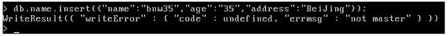

从图中可以看出mongodb不允许slave服务器上进行写入操作。

## Replica set（复制集）架构

&emsp;&emsp;ReplicaSet使用的是n个mongod节点，构建具备自动容错功能，自动恢复的高可用方案。使用ReplicaSet来实现读写分离，在从库中指定slaveOk，由primary承担写操作，secondary承担读的压力。
对于ReplicaSet中的secondary节点默认是不可读的。

### 实验环境
+ 操作系统：centos
+ 实验服务器IP：192.168.0.30、192.168.78.235、192.168.78.236

### 过程

分别在三台服务器上安装mongodb，之后启动mongod，如下图所示：

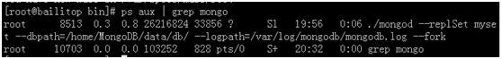

在这三台服务器中选择一台开启mongo，本文在192.168.0.30上开启mongo,并执行如下操作：

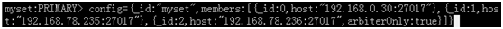

也就是下面的配置过程：
> config={_id:”myset”,members:[{_id:0,host:"192.168.0.30:27017"},{_id:1,host:"192.168.78.235:27017"},_id:2,host:"192.168.78.236:27017",arbiterOnly:true}]}

执行完上面的配置后，进行初始化，命令如下：
> rs.initiate(config)

如果想查看配置内容，执行完下面的命令即可：
> rs.conf()

如果想查看状态信息，执行下面的命令：
> rs.status()

在同一时刻，每组Replica Sets只有一个Primary用于接受写操作，而后会异步复制到其他成员数据库中。一旦primary死掉，会自动投票选出新任的primary，原服务器恢复后成为普通成员。如果数据尚未从先前的primary复制到成员服务器，有可能会丢失数据。  
在secondary上允许读操作，执行如下命令即可：


### 测试

在192.168.0.30上执行插入语句，如下图：

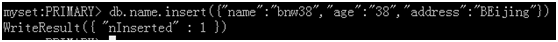

在192.168.78.235上执行查询语句，如下图：

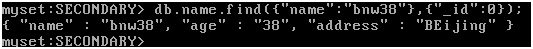

### 测试自动转移

当把192.168.0.30上的mongod进程关闭后，查看192.168.78.235的状态，将会发现192.168.78.235由secondary状态转变化primary状态，如下图：

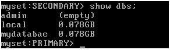

此时，启动192.168.0.30上的mongod，原先的primary将变成普通的secondary，如下图：

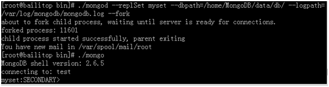

**增加节点**

新开一个服务器，IP为192.168.78.237，启动mongod，命令如下：


开启mongod后，在primary上添加节点，如下图所示：

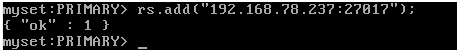

添加完后，到192.168.78.237服务器上查看效果，如下图：

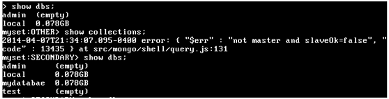

状态先变为OTHER，而后再成为secondary。

**减少节点**

在primary节点执行rs.remove()指令，可以删除节点。

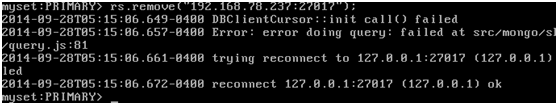

删除节点后，查看删除后的状态变为REMOVED，如下图所示：

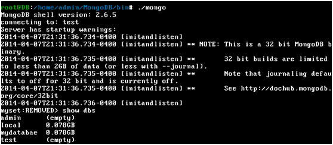

## 分片集群架构

&emsp;&emsp;mongodb的扩展方式，sharding，如果业务数据和系统负载不断增加，可以通过分片来解决。所谓分片就是将数据拆分，分散到不同的服务器上，从而处理更大的负载存储大数据。Mongodb支持自动分片，集群自动的切分数据，做负载均衡，避免分片管理的难度。Mongodb分片是将集合切合成小块，分散到若干片里面，每个片负责所有数据的一部分。这些块对应用程序来说是透明的，不需要知道哪些数据分布到哪些片上，甚至不在乎是否做过分片，应用程序连接mongos进程，mongos知道数据和片的对应关系，将客户端请求转发到正确的片上，如果请求有了响应，mongos将结果收集起来返回给客户端程序。  

分片适用场景：  
1.服务器磁盘不够用  
2.单个mongod不能满足日益频繁写请求  
3.将大量数据存放于内存中提高性能  

建立分片需要三种角色：  
**1.shard server**  
保存实际数据容器，每个shard可以是单个mongod实例，也可以是复制集，即使片内有多台服务器，只能有一个主服务器，其他的保存相同数据的副本。为了实现每个shard内部的auto-failover，强列建议为每个shard配置一组Replica Set。  
**2.config server**  
为了将一个特定的collection存储在多个shard中，需要为该collection指定一个shardkey，shardkey可以决定该条记录属于哪个chunk。Config servers就是用来存储：所有shard节点的配置信息，每个chunk的shardkey范围，chunk在各shard的分布情况，该集群中所有DB和collection的sharding配置信息。  
**3.route server**  
集群前端路由，路由所有请求，然后将结果聚合。客户端由此接入，询问config server需要到哪些shard上查询或保存数据，再连接到相应的shard进行操作，最后将结果返回给客户端。客户端只需要将原先发送给mongod的请求原封不动的发给mongos即可。

**shard key**  
设置分片时，需要从集合中选一个键，作为数据拆分的依据，这个键就是shard key。Shard key的选择决定了插入操作在片之间的分布。Shard key保证足够的不一致性，数据才能更好的分布到多台服务器上。同时保持块在一个合理的规模是非常重要的，这样数据平衡和移动块不会消耗大量的资源。

### 实验环境

+ 操作系统：centos
+ 实验服务器IP：192.168.0.30、192.168.78.235、192.168.78.236、192.168.78.237

### 过程

整体配置如下所示：
```shell
192.168.0.30：mongos
192.168.78.235
Shard1:10001
		Shard2:10002
		Shard3:10003
		Config1:2000
192.168.78.236
		Shard1:10001
		Shard2:10002
		Shard3:10003
		Config2:2000
192.168.78.237
		Shard1:10001
		Shard2:10002
		Shard3:10003
		Config2:2000
```

**首先，配置shard1的replica set**  
192.168.78.235

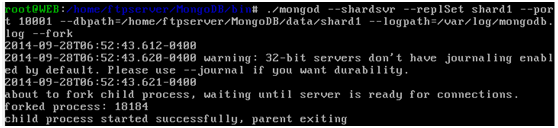

192.168.78.236

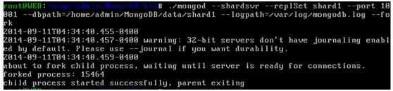

192.168.78.237

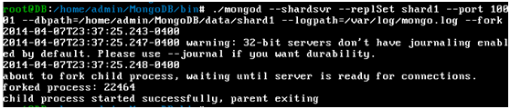

在其中一台登陆mongo客户端，之后进行config配置，如下图：


配置完config，接下来就是要进行初始化，如下图：

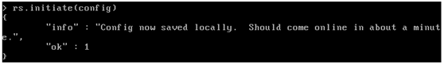

Shard2与shard3的操作步骤与shard1的操作步骤完全一样,注意端口号。

**配置config server**  
192.168.78.235

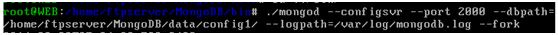

192.168.78.236

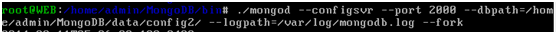

192.168.78.237


**配置mongos**  
192.168.0.30

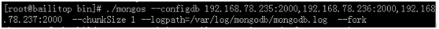

## mongodb的认证

&emsp;&emsp;mongoDB目前只支持最基本的安全认证，如果我们开启了安全性检查，则只有数据库认证用户才能进行读写操作，当然我们还可以创建读写权限用户和只读权 限用户，如果我们在admin的数据库中进行创建用户，那么admin中的用户就会被当作超级用户，超级用户可以读写所有的数据库，并且还可以进行特殊的 管理操作，比如可以再创建其他用户关闭进程等操作。Mongodb默认是不开启认证的。  
MongoDB的安全认证其实还是简陋的，所以还是有其他很多的安全考虑：  
1.比如说MongoDB传输协议是不加密的，如果需要加密的话，我们可以考虑使用ssh隧道或是他们的技术来对客户端和服务端之间的通讯进行加密。  
2.将MongoDB部署在只有客户端服务器才能访问到的环境，比如内网，vpn网络中，可以使用 bind_ip = 本机或内网 。  
3.如果确实需要将MongoDB暴露在外部环境可以考虑使用IPTABLES等技术进行访问限制


