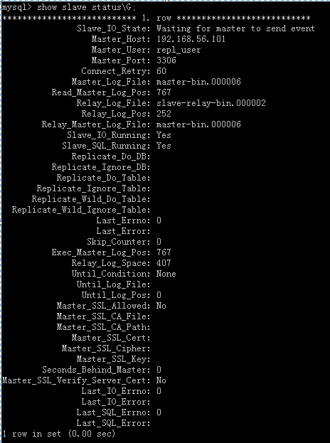

# Title: mysql的主从复制

## 原理
&emsp;&emsp;通过将Mysql的某一台主机的数据复制到其它主机（slaves）上，并重新执行一遍来实现的。复制过程中一个服务器充当主服务器，而一个或多个其它服务器充当从服务器。主服务器将更新写入二进制日志文件，并维护文件的一个索引以跟踪日志循环。
整体上来说，复制有3个步骤：  

&emsp;&emsp;1.master将改变记录到二进制日志(binary log)中（这些记录叫做二进制日志事件，binary log events）  

&emsp;&emsp;2.slave将master的binary log events拷贝到它的中继日志(relay log)  

&emsp;&emsp;3.slave重做中继日志中的事件，将改变反映它自己的数据。  

## 实验环境

&emsp;&emsp;操作系统：centos 6.5 x86_64  

&emsp;&emsp;master服务器IP:192.168.56.101  

&emsp;&emsp;slave服务器IP: 192.168.56.102  

## 主服务器配置

需要进行复制的数据库
> binlog-do-db = mydatabase

不需要进行复制的数据库
> replicate-ignore-db = mysql  
replicate-ignore-db = test  
replicate-ignore-db = information_schema

重启master服务器，运行show  master  status,输出如下：

### 授权
在master上对帐户进行授权，命令如下：

执行完成后，查看mysql数据库里的user表里，是否存在我们设置的帐户，如图所示：

## 从服务器

**说明：**从服务器没必要开启二进制日志，但是在一些特殊的情况下，必须设置，比如将slave作为其他slave的master。
### 启动slave
接下来就是让slave连接master。不需要通过配置文档进行该操作，而只需要使用change master  to语句即可，该语句可以完全取代对配置文件的修改，而且它可以为slave指定不同的master，而不需要停止服务器。如下：

执行start  slave语句，启动slave。  
执行show  slave  status\G语句用于查看slave状态，如图所示：

运行效果如下：
192.168.56.101服务器

之后，查看192.168.56.102服务器上的信息，如下：

