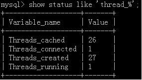
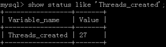
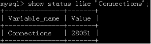
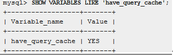

# mysql性能优化
## thread cache 命中率计算  
Mysql为了提高客户端请求创建连接过程的性能，提供了一个连接池（threads_cache），将空闲的连接线程放在连接池中，而不是立即销毁。这样的好处就是当又有一个新请求时候，mysql不会立即去创建连接线程，而是先去连接池中查找空闲的连接线程，如果存在就直接使用，不存在才创建新的连接线程。然而，连接池太大也不是好事儿，因为会浪费物理资源。
+ Mysql配置指令：thread_cache_size（默认不开启）
## 查看当前连接数
+ 命令：`show  status  like  ‘thread_%’;`  
结果如下图所示：  
  
**说明：**  
 + Threads_cached表示被缓存的线程个数
 + Threads_connected表示当前连接的线程个数
 + Threads_created表示总共被创建的线程个数
 + Threads_running表示处于激活状态的线程个数

## 命中率(Thread cache hits)的计算方法
```shell
伪代码如下：
Threads_created = show global status like ‘Threads_created’
Connections = show global status like ‘Connections’
TCH = (1 – (Threads_created / Connections))*100%
```
**样例**  
线程创建的总数为27，如下图所示：  
  
而连接总数为28051，如下图所示：  
  
那么：
```shell
TCH = (1 – 27 /28051) * 100% 
    = 99.9%
```
## QPS的计算方法
QPS是Questions Per Second的简称，即每秒查询数，通过下面的计算方法获得：
```shell
Questions1 = show status like ‘Questions’
sleep 1
Questions2 = show status like ‘Questions’
QPS = (Questions2 – Questions1) / 1
```
## TPS的计算方法
TPS是每秒事务数的缩写形式，计算方法如下：
```shell
公式：TPS = (Com_commit + Com_rollback) / seconds
具体实现：
Com_commit1 = show status like ‘Com_commit’
Com_rollback1 = show status like ‘Com_rollback’
sleep 1
Com_commit2 = show status like ‘Com_commit’
Com_rollback2 = show status like ‘Com_rollback’
QPS = ((Com_commit2 – Com_commit1) + (Com_rollback2 – Com_rollback1)) / 1
```
## Key Buffer命中率计算方法
索引是MySQL性能优化中一个重量级的角色，但并不是所有的数据库都需要开启运引缓存。通常情况下，应用中select查询占数据库操作的80%以上的都需要使用缓存索引，而如果update和insert比较多的话，使用索引缓存反而影响了MySQL性能。MySQL使用key_buffer选项来配置索引缓存的内存空间大小。  
下面是key buffer命中率的计算方法：
```shell
Mysql > show global status  like ‘key%’;
Key_buffer_read_hits = (1 – (key_reads / key_read_requests)) * 100%
Key_buffer_write_hits = (1 – (key_writes / key_write_requests)) * 100%
```
## InnoDB buffer命中率计算方法
InnoDb在内存中维护着一个存储池用于保存数据和索引。InnoDB buffer越大，innodb越能表现其优异性能，越接近内存数据库（in-memory database），为了提升磁盘写入性能，innodb会以组的形式写入磁盘。官方介绍如下：  
```shell
The larger the buffer pool, the more InnoDB acts like an in-memory database, reading data from disk once and then accessing the data from memory during subsequent reads. The buffer pool even caches data changed by insert and update operations, so that disk writes can be grouped together for better performance.
```
关于计算innodb buffer命中率的方法，有如下公式：
```shell
Mysql > show global status  like ‘innodb_buffer_pool_read%’;
innodb_buffer_read_hits = (1 – (innodb_buffer_pool_reads / innodb_buffer_pool_read_requests)) * 100%
```
## Query cache命中率计算方法
查询缓存对于提高系统性能是相当重要的。查看系统是否开启查询缓存可以查看mysql系统变量`have_query_cache`,例如：  
  
**注意：**如果mysql使用的是非源码安装的话，不管查询缓存是否开启，该变量值都是yes。通过配置参数query_cache_type也可以进行开启或关闭查询缓存，该值为非零时表示开启查询缓存。同时配置参数query_cache_size来设置查询缓存的大小。  
计算查询缓存命中率的公式，如下：
```shell
Mysql > show global status like ‘Qcache%’;
Query_cache_hists = (Qcache_hits / (Qcache_hits + Qcache_inserts)) * 100%
```
说明：Qcache_hits表示缓存的命中计数，Qcache_inserts表示往缓存中添加的查询数。  
## 读写比
读写比是优化数据库相当重要的依据，读的多就去优化读，写的多就去优化写。
```shell
Qcache_hits = show global status like ‘Qcache_hits’
Com_select = show global status like ‘Com_select’
Com_insert = show global status like ‘Com_insert’
Com_update = show global status like ‘Com_update’
Com_delete = show global status like ‘Com_delete’
Com_replace = show global status like ‘Com_replace’
R/W = (Com_select + Qcache_hits) / (Com_insert + Com_update + Com_delete + Com_replace) * 100%
```
## 锁定状态
通过计算Table_locks_waited / Table_locks_immediate值来判定表锁定造成的阻塞情况，如果该值比较大的话，说明表锁造成的阻塞比较严重。innodb_row_lock_waits记录innodb行锁情况，如果其值较大，可能是由于间隙锁造成的。  
计算方法如下：
```shell
Mysql >  show status like ‘%lock%’;
锁定状态 = Table_locks_waited / Table_locks_immediate
```
## Opened_tables
该值表示表缓存没有命中的数量。如果该值很大，可能需要增加table_open_cache的数值。
```shell
Mysql > show status like ‘Opened_tables’;
```
## Select_scan
该值表示全表搜索查询的数量。在某些情况下是没有问题的，但占总查询数量比值应该是一个常量（即Select_scan /总查询数量 应该是一个常数）。如果该值持续增长，说明需要优化。  
```shell
Mysql > show status like ‘select_scan’;
```