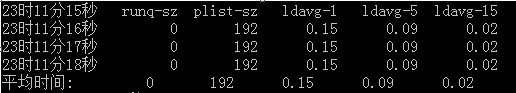

# Title: 服务器性能瓶颈检测


## CPU负载
---------------
### 定义

&emsp;&emsp;一般情况下可以将单核CPU看成一条单行的桥，数字1代表CPU刚好能够处理过来，即桥上能够顺利通过所有的车辆，桥外没有等待的车辆，也就是说桥是畅通的。当超过1时表示有等待上桥的车辆，小于1时表示车辆能够快速地通过。单核心CPU就表示该CPU能够处理的事务数是1。在多核CPU中，CPU能够并发处理的事务数是CPU个数*CPU核心数，而且负载数最好不要超过这个值。例如一个4核的CPU，则cpu_load最大为4，不要长期超过4，否则会有任务没有得到及时的处理而使系统的负载累积增高导致系统运行缓慢。  
&emsp;&emsp;大多数unix系统中的负载只是记录那些处在运行状态和可运行状态的进程，但是linux有所不同，它会包含那些不可中断的处于睡眠状态的进程。这时当这些进程由于I/O的阻塞而不能够运行，就可能显著地增加CPU的负载。因此在unix和linux下的CPU负载计算方法是不一样的。

### CPU负载监测值的设定


&emsp;&emsp;在知道CPU的负载和对主机的CPU核数有一个初步了解后，就能够在监测软件中设置CPU的负载值，达到监控CPU负载的目的，防止负载过高。通常情况下采取0.7的法则，即当CPU为4核时，CPU的整体负载不要超过4*0.7=2.8。由于在使用命令时可以提供三个CPU 负载平均值，那以哪个为准呢？在实际的监测过程中，只要CPU的负载在5分钟或15分钟内较低就可以了，因为有时在1分钟内确实会上升的很快。

### CPU利用率的观测以及负载过高的可能原因

&emsp;&emsp;CPU的负载跟CPU的利用率有什么关系呢？CPU的利用率通常会把每个核上的占用率加起来，所以就有可能超过100%。CPU的负载和利用率之间没有必然的联系，有时会出现负载过高，但利用率不高的情况，例如，有大量的并发任务，但是每个任务的CPU占用率却很低，这时就会出现CPU负载过高利用率低下的情况。同样也会出现CPU的利用率很高，但CPU负载很低的现象。  
&emsp;&emsp;系统负载突然增高，但是内存的使用量没有变化，这个时候应该考虑更加深入的原因，通常在考虑CPU负载的过程中要看内存，I/O，网络方面的问题，这样看看变化的值是哪些就能确定问题的可能范围。

## sar命令
------------

&emsp;&emsp;sar(System Activity Reporter系统活动情况报告)是目前LINUX上最为全面的系统性能分析工具之一，可以从多方面对系统的活动进行报告，包括：文件的读写情况、系统调用的使用情况、磁盘I/O、CPU效率、内存使用状况、进程活动及IPC有关的活动等。

#### sar命令的常用格式

sar [option]  [-A]  [-o file]  t  [n]  
其中：  
+ T为采集间隔，n为采样次数，默认值是1  
+  -o file表示将命令结果以二进制格式存放在文件中。 
    
option为命令选项，sar命令常用选项如下：
  


+ -A：所有报告的总和
+ -u：输出CPU使用情况的统计信息
+ -v：输出inode、文件和其他内核表的统计信息
+ -d：输出每一个块设备的活动信息
+ -r：输出内存和交换空间的统计信息
+ -b：显示I/O和传送速率的统计信息
+ -a：文件读写情况
+ -c：输出进程统计信息，每秒创建的进程数
+ -R：输出内存页面的统计信息
+ -y：终端设备活动情况
+ -w：输出系统交换活动信息

### 示例

#### 1、CPU资源监控

&emsp;&emsp;例如：每秒采集一次，采集3次退出，观察CPU的使用情况，并将采集结果输出到屏幕上，需键入如下命令：
```shell
# sar  -u  1  3
```


输出项说明：  
+ CPU：all 表示统计信息为所有 CPU 的平均值。
+ %user：显示在用户级别(application)运行使用 CPU 总时间的百分比。
+ %nice：显示在用户级别，用于nice操作，所占用 CPU 总时间的百分比。
+ %system：在核心级别(kernel)运行所使用 CPU 总时间的百分比。
+ %iowait：显示用于等待I/O操作占用 CPU 总时间的百分比。
+ %steal：管理程序(hypervisor)为另一个虚拟进程提供服务而等待虚拟 CPU 的百分比。
+ %idle：显示 CPU 空闲时间占用 CPU 总时间的百分比。

`1.若 %iowait 的值过高，表示硬盘存在I/O瓶颈`  
`2.若 %idle 的值高但系统响应慢时，有可能是 CPU 等待分配内存，此时应加大内存容量`  
`3.若 %idle 的值持续低于1，则系统的 CPU 处理能力相对较低，表明系统中最需要解决的资源是 CPU 。`  
  
#### 2、I/O和传送速率监控

例：每秒采集一次，采集5次，报告缓冲区的情况，键入命令：  

```shell
# sar–b 1  5
```


输出项说明：  
+ tps：每秒钟物理设备的 I/O 传输总量
+ rtps：每秒钟从物理设备读入的数据总量
+ wtps：每秒钟向物理设备写入的数据总量
+ bread/s：每秒钟从物理设备读入的数据量，单位为 块/s
+ bwrtn/s：每秒钟向物理设备写入的数据量，单位为 块/s

#### 3、进程队列长度和平均负载状态监控

每秒采样一次，连续采样3次，监控进程队列长度和平均负载状态，键入命令：  
```shell
# sar -q 1 3
```


+ runq-sz：运行队列的长度（等待运行的进程数）
+ plist-sz：进程列表中进程（processes）和线程（threads）的数量
+ ldavg-1：最后1分钟的系统平均负载（System load average）
+ ldavg-5：过去5分钟的系统平均负载
+ ldavg-15：过去15分钟的系统平均负载

#### 4、系统交换活动信息监控

每秒采样一次，连续采样3次，监控系统交换活动信息，键入命令：  
```shell
# sar -W 1 3
```


输出项说明：  
+ pswpin/s：每秒系统换入的交换页面（swap page）数量
+ pswpout/s：每秒系统换出的交换页面（swap page）数量

#### 5、设备使用情况监控

每秒采样一次，连续采样3次，报告设备使用情况，需键入如下命令 ：  
```shell
# sar -d 1 3 –p
```


其中：  
+ 参数-p可以打印出sda,hdc等磁盘设备名称,如果不用参数-p,设备节点则有可能是dev8-0,dev22-0
+ tps:每秒从物理磁盘I/O的次数.多个逻辑请求会被合并为一个I/O磁盘请求,一次+ 传输的大小是不确定的.
+ rd_sec/s:每秒读扇区的次数.
+ wr_sec/s:每秒写扇区的次数.
+ avgrq-sz:平均每次设备I/O操作的数据大小(扇区).
+ avgqu-sz:磁盘请求队列的平均长度.
+ await:从请求磁盘操作到系统完成处理,每次请求的平均消耗时间,包括请求队列等待时间,单位是毫秒(1秒=1000毫秒).
+ svctm:系统处理每次请求的平均时间,不包括在请求队列中消耗的时间.
%util:I/O请求占CPU的百分比,比率越大,说明越饱和.
+  avgqu-sz 的值较低时，设备的利用率较高。
+  当%util的值接近 1% 时，表示设备带宽已经占满。

### 判断系统瓶颈问题

如果想判断系统瓶颈的问题所在，有时需几个sar命令选项结合起来：  
+ 怀疑CPU存在瓶颈，可用 sar -u 和 sar -q 等来查看
+ 怀疑内存存在瓶颈，可用 sar -B、sar -r 和 sar -W 等来查看
+ 怀疑I/O存在瓶颈，可用 sar -b、sar -u 和 sar -d 等来查看

