# Title: gitlab的使用手册

## 登陆系统

&emsp;&emsp;用户的注册在后台被关闭，只有管理员才可以在后台进行用户的填加。下图是用户登陆界面：

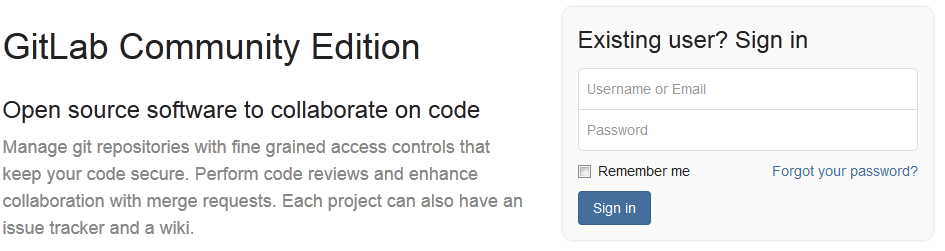

## 创建项目

&emsp;&emsp;登录系统后可以进行项目的创建，普通用户最多只能创建10个项目（这个数值在后台可以调整），管理员可以创建10000个。项目的创建与github一样，如下图所示：

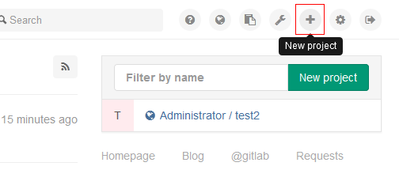

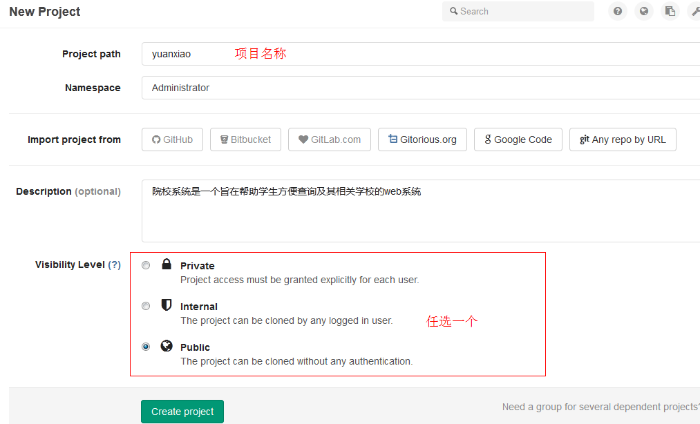

## 添加项目成员

&emsp;&emsp;给项目添加项目成员可以让某些成员参与到项目的开发工作之中，而非项目成员可以克隆项目，但无权向项目进行push操作。

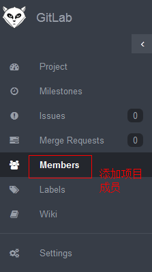
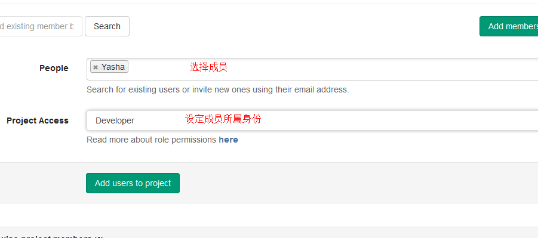

## 分支保护

&emsp;&emsp;在团队协作开发过程中，为了防止相关成员 push 代码到重要的分支（例如 master 分支）,往往将重要的分支保护起来，只有相关权限人员才可以将代码push到受保护分支上去，便于项目的分支管理。

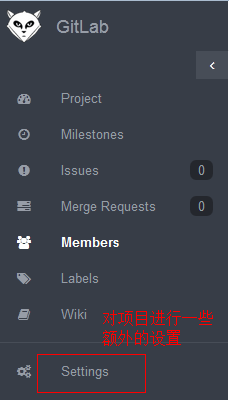
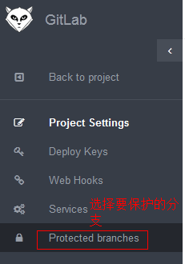
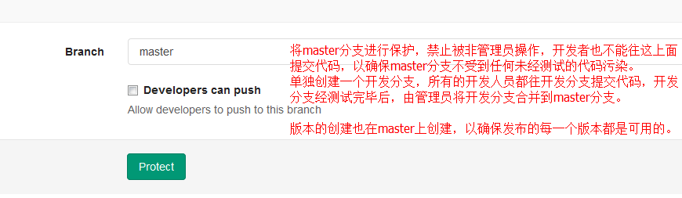
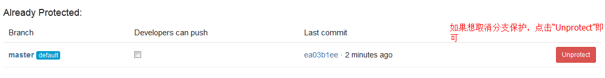

## 请求合并

&emsp;&emsp;当重要分支被保护起来后，某些成员无权push代码到重要分支上去（特别是代码贡献者），只能向项目管理员提交合并请求。项目管理员查看用户提交的代码并进行审核，审核通过后会接受用户的合并请求。

**新建请求**
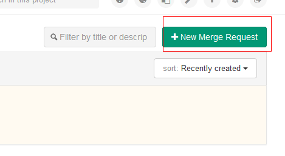
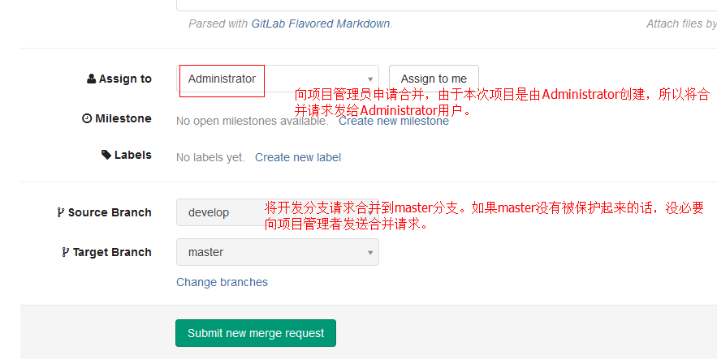

## 接受合并请求

&emsp;&emsp;当某些用户向项目管理者提交合并请求时，项目管理者会对用户提交的代码进行审核。

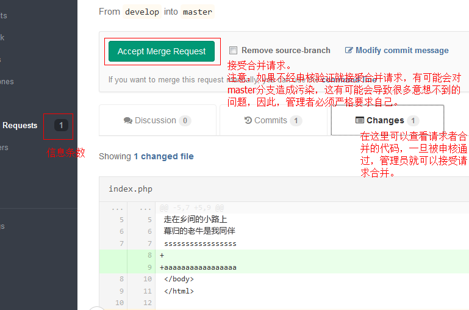

## 克隆（检出）项目

&emsp;&emsp;项目的检出在git里叫克隆，可以使用ssh、http和https，其中，ssh与https属于安全模式。具体使用如下：

**ssh**
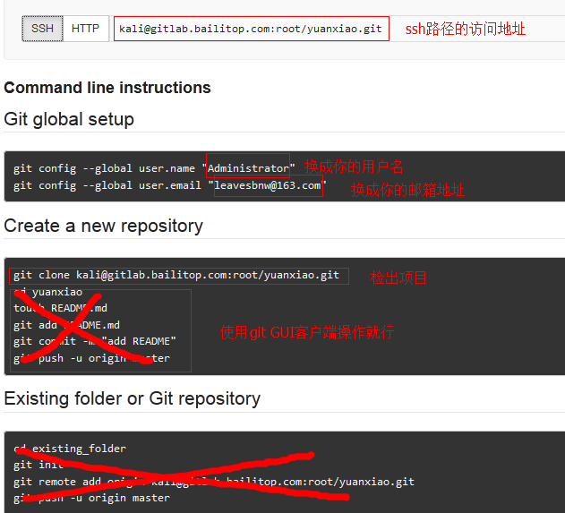

**http**
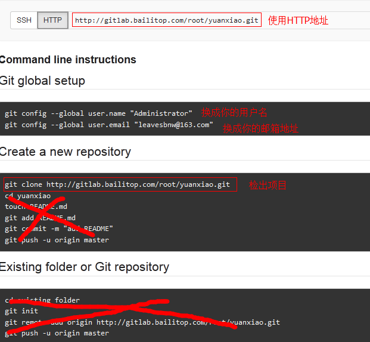

## gitlab与其他系统进行集成

&emsp;&emsp;系统集成可以扩展系统能力，构建一整套的生态环境。gitlab可以与很多系统进行项目集成，比如gitlab ci、jira、redmine、hipchat等等。这里介绍与redmine的集成。  
&emsp;&emsp;在【Setting】-->【Services】里可以查看到很多可以与gitlab相集成的系统，一旦集成成功，它的图标由灰变成绿色，如下图：

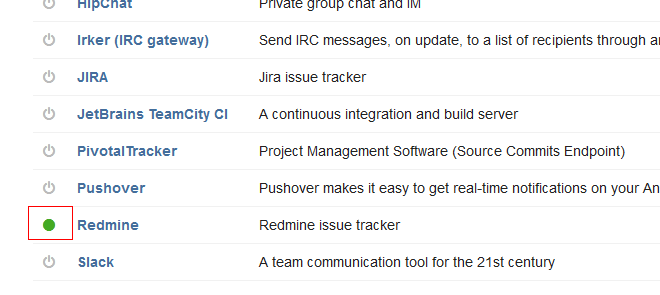

&emsp;&emsp;上图中gitlab只与redmine进行了集成，其他系统都没有进行集成。与redmine集成很方便，只需要在gitlab里设定redmine的URL即可，如下图所示：

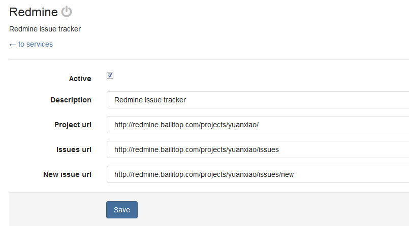

