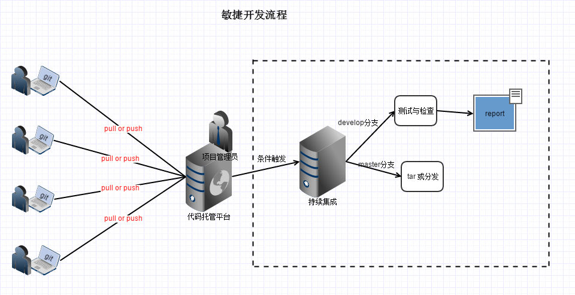
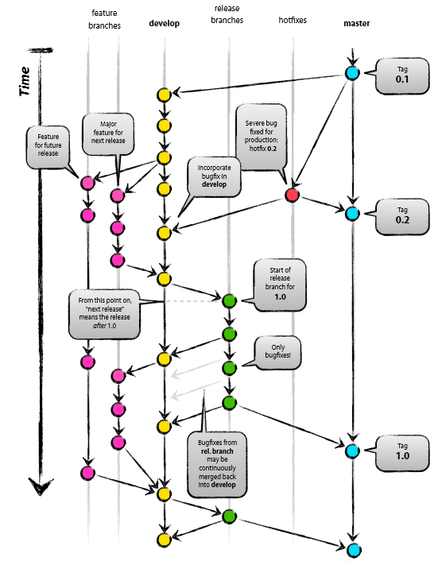

# Title: 项目开发流程与规范

## 敏捷的开发流程

## git分支模型(git flow)

** 分支策略 **  

在实际开发中，我们应该按照几个基本原则进行分支管理：  
首先，master分支应该是非常稳定的，也就是仅用来发布新版本。  
其次，平时干活都在dev分支上，也就是说，dev分支是不稳定的，到某个时候，比如1.0版本发布时，再把dev分支合并到master上，master分支发布1.0版本。

## github flow

有了git flow为何还要github flow？由于git flow比较复杂，并不是每个项目都需要这么做，为了简化工作流，github制订了简化版的git flow，名为github flow。

**什么是github flow?**  

+ Anything in the `master` branch is deployable**(主干分支是最稳定的，仅用于发布版本）**
+ To work on something new, create a descriptively named branch off of master (ie: new-oauth2-scopes)**(如果开发新功能，从主分支上创建一个名字具有功能描述性的分支，比如分支new-oauth2-scopes)**
+ Commit to that branch locally and regularly push your work to the same named branch on the server**(保持本地与远程分支代码一致)**
+ When you need feedback or help, or you think the branch is ready for merging, open a pull request**(一旦功能开发完成，向主分支发送合并请求)**
+ After someone else has reviewed and signed off on the feature, you can merge it into master**(一旦代码审核完成，管理者即可接受请求)**
+ Once it is merged and pushed to ‘master’, you can and should deploy immediatelely**(一旦被合并到主分支上去，管理者需要即刻分发部署 )**

## 公司开发规范

+ 公司的开发工作流采用github flow
+ git分支的命名格式采用:  `用户名_分支创建日期_项目模块名称_功能描述`  
比如：bailitop用户正在开发一个web系统的api接口中的oauth2功能，那么分支名称为: `bailitop_20150806_webapi_oauth2`
+ 没必要每一项小功能或者修改都创建一个分支，如有需要请参考上一条规则
+ 用完的分支请删除，删除前请确保分支上的内容已推送到合适的分支上去，避免数据丢失
